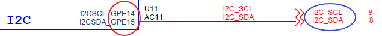
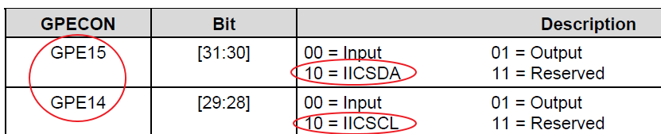
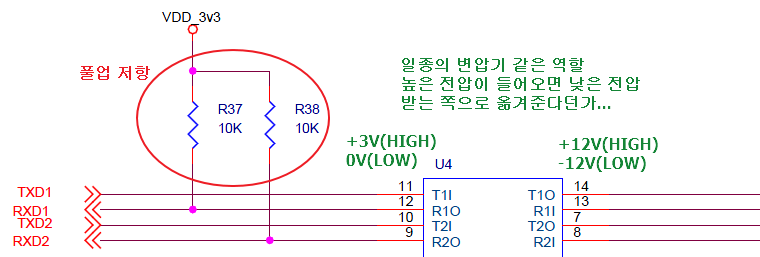

# 2일차
## 풀업 풀다운 저항과 회로

- 풀업 풀다운 사용 이유
  - 플로팅을 없애고 애매한 신호값을 high, low 값으로 컨트롤된 신호로 받기위해(?)
## I2C 통신   
- RS232c 트랜시버(트랜스와 리시버의 합성어, 디지털신호를 보내고 받는다.)
  - 선 두가닥으로 하나는 보내고 하나는 받는다. 
- I2C(Inter-Integrated Circuit) 
  - 필립스에서 개발한 직렬 컴퓨터 버스이며 여러 개의 저속의 주변 기기를 연결하기 위해 사용된다. 시리얼 통신에 사용되는 UART 또는 SPI들보다 더 단순하여 심플한 회로 구성이 가능하다
  - 선 두가닥으로 IO 제어
  
  
    - 한 가닥은 클럭으로 사용(uart는 한가닥으로 사용)
    - I2C 버스는 SDA(Serial Data)와 SCL(Serial Clock) 두개의 신호선으로 구성
    - IICSCL, IICSDA : 제 3의 기능(INPUT도 아니고 OUTPUT도 아닌...)(I2C 방식)
  - mI2C_SCL : 꼭 풀업,풀다운 저항을 달아줘야하는 통신방식
- [UART와 I2C 차이점](http://stackrefactoring.blogspot.com/2017/09/serial-uart-vs-spi-vs-i2c.html)

> 바이너리 파일, 텍스트 파일
- 바이너리 파일 : 오브젝트 파일
  - EX> 3400 -> 34란 0x34인지 데이터 34인지 알수없어
  - hexdump -C exception.o |more : 리눅스 환경에서 오브젝트 파일 내부 확인가능

## UART 통신   
- UART(범용 비동기화 송수신기: Universal asynchronous receiver/transmitter)는 병렬 데이터의 형태를 직렬 방식으로 전환하여 데이터를 전송하는 컴퓨터 하드웨어의 일종이다.  
- 비동기 직렬 통신을 지원하는 하드웨어
- TX : 보낸다. 
- RX : 받는다. 
      
	    
- AMBA : ARM 프로세서에서 만든 버스
  - 버스란 ? information 전달되는 bus
    - USB, PCI, I2C가 이동하는 통로의 공통점
    - usb, pcl i2c 정보가 전달되는 파이프라인, 버스
  - 
```C
#define	FCLK		534000000	// 534.000MHz (400MHz)
#define	HCLK		(FCLK/4)		// 133.000MHz (100MHz)
#define	PCLK		(FCLK/8)		// 66.0000MHz (50MHz)
```
- HCLK : AHB(속도 빨라, 고속도로)
- FCLK : CPU 속도 
- PCLK : APB(속도 느려)

* UART 초기화
```C

void Uart_Init(int baud)
{
	int pclk;
	pclk = PCLK; // AMBA APB 버스 클럭 
	
	// PORT GPIO initial( rGPHCON )
        /* YOUR CODE HERE */  
    rGPHCON=(rGPHCON &~ (0xf<<4))|(0xa<<4);
	// rGPHCON=(rGPHCON &~ (0xf<<4))|(0xf<<4);
	rUFCON1 = 0x0;
	rUMCON1 = 0x0;
	
	/* Line Control(Normal mode, No parity, One stop bit, 8bit Word length */
	rULCON1 = 0x3;

	/* Transmit & Receive Mode is polling mode  */
	rUCON1  = (1<<2)|(1);

	/* Baud rate 설정  */		
	rUBRDIV1= ((unsigned int)(PCLK/16./baud+0.5)-1 );
}
```
> 소스 파악 노하우  
> UART 관련 소스 볼때 매뉴얼에서 UART 전부 보는게 아닌  
> 우선 소스에서 해당 하는 함수에서 사용하는 레지스터만 찾아보기  
> 위 소스에서 사용한 레지스터   
> * rGPHCON, rUFCON1, rUMCON1, rULCON1, rUCON1, rUBRDIV1

- rUBRDIV1 레지스터
  - 통신 속도를 조절


- uart 통신때 
  - loopback 사용하면
    - tx -> rx 바로 돌아와!!
    - 왜 사용?
      - loopback 모드로 하면
      - 소프트웨어 검증하기위해(어떤 오류가 날때 하드웨어적 문제인지 소프트웨어인지 확인하기위해서)
        
        
- 줄바꿈 처리 윈도우 리눅스 비교
  - '\n' : newline feed(0A)
  - '\r' : carriage return(0D), 커서를 맨앞으로 오게  
  -   
  - 윈도우에서 파일과 리눅스 파일이 다르게 나올수 있어   
    - 확인! 윈도우와 리눅스 파일 따로 생성해서  hexdump -C hello.txt  
  - 그래서 0A를 보내려면 0D까지 보내야해!!!  
  -   

- UART 통신시 파일을 안깨지게 보내려면
  - ms 에서 만든 하이퍼 터미널을 설치

## minicom 사용
  - 초기과정
    - 활성화 시켜주기

    - ~/.bashrc (~ :  자신의 홈디렉토리)

    - ttyS0로 변경


### 타이머 장치 응용
1. 시간 지연(delay)
2. 시간 측정
3. pwm(신호발생)
    - prescaler : 타이머의 속도를 늦추는

```c
void Timer_Init(void)
{
	/* 
	* 	Timer0 Init 
	* Prescaler value : 255, dead zone length = 0
	* Divider value : 1/16, no DMA mode
	* New frequency : (PCLK/(Prescaler value+1))*Divider value = (66Mhz/(256))*(1/16)
	*				= 16.113Khz(16113Hz)
	*/
 /* TODO : Timer Clock Configure */
	/* prescaler, divider setting */
	rTCFG0 = (rTCFG0 &~ (0xff<<0))|255; 
	rTCFG1 = (rTCFG1 &~ (0xf<<0))|3; 
	
	/* TCON설정 :Dead zone disable,  auto reload on, output inverter off
	*  manual update no operation, timer0 stop, TCNTB0=0, TCMPB0 =0
	*/
	rTCON  = (0<<4)|(1<<3)|(0<<2)|(0<<1)|(0);
	rTCNTB0 = 0; //Timer_Delay()
	rTCMPB0 = 0;
 
}

void Timer_Delay(int msec)
{
	/*
	* 1) TCNTB0설정 : 넘겨받는 data의 단위는 msec이다.
	*                  따라서 msec가 그대로 TCNTB0값으로 설정될 수는 없다.
	* 2) manual update후에  timer0를 start시킨다. 
	* 	 note : The bit has to be cleared at next writing.
	* 3) TCNTO0값이 0이 될때까지 기다린다. 	
	*/
 /* TODO : Timer Counter Setting */
	rTCNTB0 = 16.113 * msec; //(16113/1000) * (1000)

	// 삼성칩에서만 국한된 방식
	rTCON |= (1<<1)|(0);	// manual update
	rTCON &= ~(1<<1);
	
	rTCON |= 1;	// trigger(timer start)
	
	while(rTCNTO0 != 0);
	
}
```

```c
/***************************************
 * 
 * Title: TIMER_TEST
 * 
 ***************************************/
#if EXAMPLE == 421
 	int msec;

	Uart_Send_String("TIMER TEST !!!\n\n");
	Timer_Init();

	msec= 1000;
	while(1)
	{
		Uart_Printf("%d milisecond passed...\n", msec);
		Timer_Delay(msec);
	}	 
#endif // TIMER_TEST
```