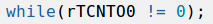
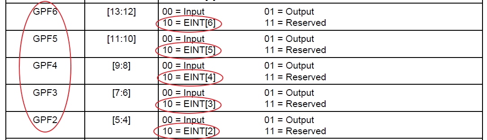

# 3일차
## 3장. 타이머
### 타이머 작동원리
   
### 주파수 및 카운터 계산 공식
    rTCNTx = HZ * 원하는 시간(sec)
    - 만약, 클럭이 1KHz이고 10초를 원한다면
      - rTCNTx = HZ * 원하는 시간(sec) = 1000 * 10
    - 원하는 시간 = 주기(클럭) * 카운터
    - 한주기마다 카운팅
    - 10초 = 1/1000 * 10000
    
    - rTCNTx = HZ * 원하는 시간(sec)  
      - 65535 = 1,562,500 * x  
      - x : 0.0419424 -> 40ms를 측정할수 있어(40ms를 시간으로 지연시킬 수 있어)  
      - 만약 더 넓은 시간으로 측정하고 싶으면 Hz를 수정할 수 있어  
      - 짧은 시간으로밖에 제어, 측정할수밖에 없어서 시간 range를 넓혀야  

    
      - 표 보는 방법  
        - pclk 를 여기서는 50MHz로 가정하고 (실제는 66MHz)  
        - divider가 1/16 이라면 prescale를 최대치로 하면 12.2027Hz  
        - divider가1/16 이라면 5.3686sec 보다 큰 시간은 제어를 할 수가 없어  
### 주기와 카운터  
    주기 : Prescale, Divider 결정짓는 부분  
    카운터 : 0~65535  
    - 시간은 무한대로 할 수 있는게 아니다.  
### dead zone
    
    
  
### timer 소스 코드
- 0을 기다리는 것  

- 시간을 측정하고 싶을 때
```c
while(1){
	ElapseTimer_Start();  //확실하진 X

	Uart_Printf("your input character\n");	
	while(dmaComplete == 0); // DMA 전송이 완료될때까지 기다림...
	dmaComplete= 0;
	Uart_Printf("your input character is %s \n",  (unsigned char*)dst);

	val = ElapseTimer_Stop(); //확실하진 X
}
```
- 두개의 Uart_Printf() 사이의 시간을 측정하고 싶을때 아래의 두개의 함수 이용
  - ElapseTimer_Start()
  - ElapseTimer_Stop()
  
```c
//
// Use Timer0 for PC_ElapsedStart
// Timer INPUT clock Resolution 1.5625MHz
void ElapseTimer_Start(void)
{
 rTCFG0 = (rTCFG0 & ~0xff) | 1;
 rTCFG1 = (rTCFG1 & ~0xf) | 3; 
 
 /* TCON설정 :Dead zone disable,  auto reload on, output inverter off
 *  manual update no operation, timer0 stop, TCNTB0=0, TCMPB0 =0
 */
 rTCON  = (rTCON & ~((1<<4)|(1<<2)|(1<<1)|(1))) | (1<<3);

 rTCNTB0 = 0;
 rTCMPB0 = 0;

 rTCNTB0 = 0xffff; // initial value(65535) for timer, 다운카운트이기에 최대치로 

 // manual update
 rTCON |= (1<<1)|(0);
 rTCON &= ~(1<<1);
 // count
 rTCON |= 1;
}

//
// Use Timer0 for PC_ElapsedStart
// Timer Resolution 1.5625MHz
unsigned int ElapseTimer_Stop(void)
{
 rTCON &= ~1;

 return (0xffff - rTCNTO0)/1562.500; // 0xffff : 65535 (max value)
 // 1562.500 : 주기(ms를 받기 위해)
}
```

## buzzer
* TOUT1 포인트!!
   
   
   

   
* 이런 클럭의 부저를 만든다면, 표시된 두 부분을 제어해야
* pwm이 아닌 시간지연을 사용
```c
void BuzzerTest(void) 
{
	Buzzer_Init();
//	Beep(TONE_BEEP, DURATION_5SEC);
	Beep(C1, DURATION_1SEC); //도
	Beep(D1, DURATION_1SEC); //레
	Beep(E1, DURATION_1SEC); //미 
```
```c
void Buzzer_Init(void)
{
	// Buzzer = GPB1
	rGPBDAT |= (0x1<<1);	//GPB1 활성화
	rGPBCON &= ~(0x3 << 2);// GPB1 2,3 bit clear
	rGPBCON |= 0x1<<2; // GPB1 output setting(buzzer니까)
}
```
```c
#define C1      523     // Do
#define C1_     554
#define D1      587     // Re
#define D1_     622
#define E1      659     // Mi

```
```c
void Beep(int tone, int duration)
{
	rTCFG0 = (0xff<<8)|(0); // timer 2,3,4 prescaler 
	rTCFG1 = (0<<20)|(3<<16); //DMA NO SELECT, DIVIDER 1/16
	
	/* TCON설정 :Dead zone disable,  auto reload on, output inverter off
	 * manual update no operation, timer0 stop, TCNTB0=0, TCMPB0 =0
	 */
	rTCNTB4 = 16.113*duration;
	rTCON &=~  (1<<22);
	rTCON |=  (1<<21);
	rTCON &= ~(1<<21);
	rTCON |=  (1<<20);

	while(rTCNTO4 !=0) 
	{
		rGPBDAT &= ~(0x1<<1);
		DelayForPlay2(BASE10/tone); // 시간 지연사용
		rGPBDAT |= (0x1<<1);
		DelayForPlay2(BASE10/tone);
	}	// 펄스 생성 
	rTCON &= ~(1<<20);
}
```
```c
void DelayForPlay2(unsigned short time)	// resolution=0.1ms
{
	/* Prescaler value : 39  */
	/* Clock Select    : 128 */
  // WDT 사용
	rWTCON=(37<<8)|(3<<3);			// resolution=0.1ms
	rWTDAT=time+10;					// Using WDT
	rWTCNT=time+10;
	rWTCON|=(1<<5);

	while(rWTCNT>10);
	rWTCON = 0;
}
```

## RTC  
- 타이머는 스탑워치라 하면 RTC는 사람이 쓰는 시계, 캘린더라고 볼 수 있다. 
- PWM 기능이 없는 타이머 기능이 들어있다.
  
- BCD 저장이란  
  
  만약 15를 저장할 때 0XF가 아닌 가독성이 떨어지므로 15로 저장하는 것  
  
  예시) HOUR은 24시까지 표현하기 위해 
- RTC 사용하는 3가지 용도
  - 시계
  - 달력(with Y2K)
  - *알람(with Low Power)
    - cpu가 전기가 들어오진 않은 상태에 인터럽트를 발생시켜 cpu에 전기를 공급하여 on 
- RTC는 독립적, 전원이 계속 공급된다.
  - INDEPENDENT POWER PIN(RTCVDD)


## WDT
시스템 감시 타이머(watch dog timer)
sw의 오동작을 감시
- 동작 원리는 타이머와 비슷  


|WDT|TIMER|  
|:---|:---|
|WTDAT|TCNTx|
|WTCNT - 읽기,쓰기 가능|TCNTOx - 읽기만 가능, 타이머 카운터 H/W|

- sw에 문제가 생기면 CPU에 RESET 시켜줄 수 있어
```c
WDT_Init();	//0.1초만에 for문을 한바퀴 돌수있다고 하면 0.1초보다 넉넉하게 줘야해 0.3초 등등...
// for문 도는 사이에 에러가 발생될수도!! 그렇기때문에 for문 한바퀴 도는 것보다 길게 줘야한다.
WDT_Start(1);

for(;;)
{
	Lcd_Draw_BMP((160-(xtmp/2)), (120-(ytmp/2)), run_er);    
WDT_clear();  // 에러가 발생하지 않으면 WDT를 클리어 시켜줘야한다.

	for(;;)
	{
		if(Touch_pressed == 1)
		{
			if((Touch_x >= (160 - (xtmp/2))) && (Touch_x <= (160 + (xtmp/2))) && (Touch_y >= (120 - (ytmp/2))) && (Touch_y <= (120 + (ytmp/2))))
			{
				Uart_Printf("\n Pressed"); 
				Lcd_Printf(80,120, BLACK, RED, 1,1," PUSH ");
				break;
			}
		}
	}
...
}
```
 * 만약 for문 안에서 에러가 날 경우 WDT를 clear 시켜주지못해서 WDT에서 RESET 시켜주도록 할 수 있다. 

### R/B


## 메모리
### 메모리 컨트롤러
- 플래시란?
  - 플래시 메모리는 지속적으로 전원을 공급받는 비활성 메모리로서 블록이라고 불리는 메모리 단위로 지울 수도 있고 프로그램할 수도 있다.
  - 가 장 일반적인 플래시 형태는 NOR와 NAND이고 이들은 CPU가 저장된 데이터에 접속하는 모드에 따라 구별될 수 있다. 
- 노어 플래시 - 프로그램(s/w)
  - 노어 플래시 메모리는 주로 프로그램을 구동시키는 실행 바이너리를 내장
- 낸드 플래시 - 프로그램 & 데이터(파일)
  - NAND 플래시는 주로 대량 저장을 위해 설계되었고 연속적인 액세스 아키텍처를 구현, 셀 크기와 가격을 최소화했다. 이 때문에 일반적으로 고용량(4Mbytes)이 필요한 데이터 저장 애플리케이션에 주로 사용된다.
- IROM
  - 내장된 메모리, 최소한이 기능만 구현하도록 작은 메모리
  - EX> 외부 메모리 어떤거 사용할지 세팅해 놓은거를 저장할 공간이 필요

|controller|외부 memory|etc|
|:--|:--|:--|
|SSMC|SROM|대부분(노어 플래시,SRAM,EPROM 등, EEPROM은 제외)|
|NFCON|NFLASH|낸드 플래시|
|CFCON|CF|SD카드|
|DRAMC|SDRAM||

## 디바이스 제어
- 터치를 확인 하려면?
  - 폴링(polling) : 계속 그 스위치를 sw가 확인, 여러모로 낭비  
    - 소비전력 낭비!! => 인터럽트 필요 
  - cpu가 정지 신호를 감지(인터럽트)
- 인터럽트 사용하기 위한 정보 


TIMER0 -> 다른 레지스터와 동일하게 구성되어 10번비트에 TIMER0
- 인터럽트 상태 클리어 방법
  - 틀린 것
```c
      /* TODO : Pending Register Clear */
       rSRCPND1 &=~ (1<<10);
       rINTPND1 &=~ (1<<10);

      /* |= 하면 11번도 지워질수도 */
       rSRCPND1 |= (0<<11)|(1<<10);
       rINTPND1 |= (0<<11)|(1<<10);
```
  - 맞는 것
```c
      /* TODO : Pending Register Clear */
       rSRCPND1 = (1<<10);
       rINTPND1 = (1<<10);
      /* 7, 10 bit clear */
       rSRCPND1 = (1<<7)|(1<<10);
       rINTPND1 = (1<<7)|(1<<10);
```


```c
// ISR Declaration
 __attribute__((interrupt("IRQ"))) void  Timer0_ISR(void)
{
        /* TODO : Pending Register Clear */
        // rSRCPND1 = (0<<0);
        // rINTPND1 = (0<<0);
       rSRCPND1 = (1<<10);
       rINTPND1 = (1<<10);

        Uart_Send_String("Timer ISR\n");  
}
```
```c
/***************************************
 * 
 * Title: TIMER_INTERRUPT_TEST
 * 
 ***************************************/
#if EXAMPLE == 422
 	int msec;
 	
	Uart_Send_String("TIMER TEST !!!\n\n");
	Timer_Init();

       HandleTIMER0 = (unsigned int)Timer0_ISR; //timer time out되는시간 

        /* TODO : Interrupt Unmasking */
       rINTMSK1 &= ~(1<<10);

	msec= 1000;

	Timer_Delay(msec);

	while(1)
	{
		
	}	 
#endif // TIMER_INTERRUPT_TEST
```

### 인터럽트 개념도

  인터럽트 신호 전달 체계  
  
|ARM|<-- rINTPND1|<-- rINTMSK1|<-- rSRCPND1|<-- 주변장치|  
|:--:|:--:|:--:|:--:|:--:|  
||(마스킹 이후)|(마스킹)|(마스킹하기 전)|| 
|UART 정보|UART 정보|USB 마스킹|UART, USB|UART, USB|
* 인터럽트 마스크(킹)
  * PIC로 신호가 들어와도 ARM까지 가지 X (무시할 수 있게 해준다.)
  * 일종의 걸러주는 작업으로 이해하면 편할 듯
* 인터럽트가 높더라도 마스킹되있으면 인터럽트 요청이 안 들어오게 된다.


  * rINTPND1
    * 우선순위를 더 높은 것을 처리하도록하는 기능
    * 인터럽트 번호를 알수있어
    * 어느 비트에 1인지 확인하려면 알고리즘 필요
      * 삼성에서는 사용자의 편의성을 고려햐여 하나의 레지스터를 더 만들었어
      * rINTOFFSET = 5(rINTPND1 ? 0b00100000) => 5번 비트가 1임을 간단히 알 수 있도록
  * programmable interrupt controller(PIC)
    * 프로그램 가능 인터럽트 제어기는 컴퓨팅에서 우선 순위를 인터럽트 출력에 할당하는 것을 허용하면서 하나 이상의 CPU 라인으로 여러 소스의 인터럽트를 병합하기 위해 사용하는 장치이다. 
      
  * 인터럽트 컨트롤러란?
    * 인터럽트 멀티플렉서(다중화, MUX?)
    * PIC 두개를 주종관계, 대등관계등으로 설정  
  * IRQ  
    * 위 개념도에 의하면 /IRQ에 negative가 들어와야
      * negative란 기존에 LOW였던 0을 HIGH 값으로 인식한다는 것
    * IRQ(Interrupt ReQuest)  
    * 컴퓨팅에서 인터럽트 요청, 인터럽트 신호를 처리하는 데에 쓰이는 컴퓨터 버스 라인의 인터럽트 행위, 또는 프로그래머블 인터럽트 컨트롤러의 인터럽트 입력 라인을 가리킨다.
  
    - nReset, /Reset : negative가 high!!
  
  

  * PC(프로그램 카운터 레지스터) 여기에 함수 주소 hwlsr이 들어가 있어서 실행된다. 
  * hwlsr() 함수
    * 2번부분 check int num -> ARM은 인터럽트가 어디서,왜 들어왔는지 알 수가 없으니까
      * **인터럽트 상태 레지스터** 체크(PIC primary한테서)
        * PIC primary : 인터럽트 상태 레지스터
        * PIC secondary : 인터럽트 상태 2 레지스터
    * 3번과 4번 사이에 빠진 부분
      * 인터럽트 상태 레지스터 클리어!!
        * 클리어 안하면 계속 신호가 들어와
      * 클리어 순서 주의! 
        * ARM이 UART를 정리하고 그다음 PIC secondary, PIC primary 순차적으로 클리어해야해!! 
  * 인터럽트 우선순위
    * 정적 우선순위 : 정해진 것
    * 동적 우선순위 : 맘대로 변경가능
  * UART Rx
    * IRQ VS FIQ
      * FIQ가 가장 우선순위 높다.(?)
      * IRQ : Interrupt ReQuest
      * FIQ : Fast Interrupt reQuest
      * arm 에서 FIQ 가 IRQ 보다 빠르다. 

  
```c
rINTMSK1 = rINTMSK1 &~ (1<<1); //ETHER(IRQ Active)
// rSRCPND1 ? 0b10000010
// rINTPND1 ? 0b00000010
rSRCPND1 = (1<<3); //1st(0b10000010 -> 0b10000010) // 변화없음
rSRCPND1 = (1<<1); //1st(0b10000010 -> 0b10000000)

// 만약 |= 한다면?
  rSRCPND1 |= (1<<1); //1st(0b10000010 -> 0b00000000)
// 건드리지 않은 비트도 클리어

rINTPND1 = (1<<1); //2nd(0b00000010 -> 0b00000000)

```


### KEY 제어

* 폴링 방식 Vs 인터럽트 방식
  * 폴링 방식 : 정해진 시간 또는 순번에 상태를 확인해서 상태 변화가 있는지 없는지를 체크하는 방식이다. 
  * 폴링 방식과 인터럽트 방식은 논리적으로 둘다 외부의 신호에 의해 다른 작업을 하는 것이지만 회로 상으로 볼때 전혀 다르다. 
  * 폴링 방식은 버튼의 신호 유무를 판단하기 위해서는 버튼의 입력이 들어 왔는지 안들어 왔는지를 MCU가 계속해서 확인
  * 인터럽트 방식은 메인 루틴에서 하던일을 잠시 멈추고 실행되는 것이기에 메인루틴 프로그램만 작성하면 된다.



```c
#if EXAMPLE == 424
	/* External Interrupt Test */
	Uart_Send_String("Press any key : waiting key interrupt.....\n");	
	Key_INT_Init();
	for(;;); // endless loop
#endif // KEY_INTERRUPT_TEST
```
```c
void Key_INT_Init(void)
{
	/* Set External Interrupt Vector */
	HandleEINT2 = (unsigned int)Key_ISR; // 인터럽트 등록 
	HandleEINT3 = (unsigned int)Key_ISR;
	HandleEINT4_7 = (unsigned int)Key_ISR;
	
	/* GPFCON, GPGCON - outputmode GPF7, GPG0*/
	/* Intialize GPGDAT, GPFDAT low */
	/* YOUR CODE HERE */
	rGPGDAT &= ~0x1;
	rGPFDAT	&= ~(0x1<<7);
	
	rGPGCON &= ~(0x3);
	rGPGCON |= 0x1;	
	rGPFCON &= ~(0x3<<14);
	rGPFCON |= 0x1<<14;
		
	/* Intialize GPIO and External Interrupt Input */
	/* 
	 * GPFCON - interrupt mode
	 *	  bit[5:4] - GPF2, 10=EINT2
	 *    bit[7:6] - GPF3, 10=EINT3
	 *    bit[9:8] - GPF4, 10=EINT4
	 *    bit[11:10] - GPF5, 10=EINT5
	 *	  bit[13:12] - GPF6, 10=EINT6
	 */
	/* YOUR CODE HERE */
	rGPFCON = rGPFCON & ~(0x3ff<<4);
	rGPFCON = rGPFCON |  (0x2aa<<4);

	/* 
	 * EXTINT0
	 *    bit[10:8]  - EINT2, 000=low level, 001=high level,
	 *                01x=falling edge, 10x=rising edge, 11x=both edge
	 *    bit[14:12] - EINT3,
	 *    bit[18:16] - EINT4, 
	 *    bit[22:20] - EINT5,
	 *    bit[26:24] - EINT6,      
	 */
	rEXTINT0 = (rEXTINT0 & ~(0xfffff<<8))|(0x22222<<8);
	
	/* Intialize Interrupt Controller */
	/* EINT2~6에 해당 */
	rINTMSK1 &= ~(0x7<<2);	//2,3,4~7
	rEINTMASK &= ~(0x7<<4);	//4,5,6
}
```
```c
void Key_ISR(void)
{
	int temp_GPFCON, input_value;
	
	/* GPFCON을 input mode로 변경시키기 위해 interrupt mode의 값을 저장 */
	temp_GPFCON = rGPFCON;	
	/* GPFCON을 input mode로 변경 */
	rGPFCON &= ~(0x3ff<<4);
	rGPFUDP &= ~(0x1f<<2);
	/* input 모드 상황에서 눌려진 키값을 확인 */
	while (! (input_value= Key_Get_Pressed()));
	Uart_Printf("Key Value =%d\n",  input_value);
	/* 다시 interrupt 모드로 변경 */
	rGPFCON = temp_GPFCON;
	/* Keyout 값을 0으로 설정해놓고 ISR을 빠져 나옴 */
	rGPGDAT &= ~0x1;
	rGPFDAT &= ~(0x1<<7);
	 
	/* clear global interrupt pending */
	rEINTPEND = (0x7<<4);
	rSRCPND1 = (0x7<<2);
	rINTPND1 = (0x7<<2);
}
```

> 북마크 기능  
> ctrl + F2 : 등록, 해제  
> F2 : 북마크간에 이동    


> 만약 NAT 연결에도 ping 8.8.8.8이 안되면?
> vm 15 player로 설치
> 그래도 안되면?
> 1. asix 네트워크를 꼭 분리
> 2. 리눅스 터미널에서 다음의 명령을 입력
> 3. sudo ifdown eth0 && sudo ifup eth0; ping 8.8.8.8 

> 참고  
> 초보 엔지니어용 보드 혹은 ARM 프로세서  
> STmicro & ATMEL  
> TI(Texas Instrument) - 메뉴얼이 자세해, 어렵다, 하이클래스  
> Broadcom - 비추!!!  
> 라즈베리파이 프로세서 공부를 할수없어, 리눅스에 파이썬공부는 추천(소스가 많아)
> NVDIA tx1, tx2