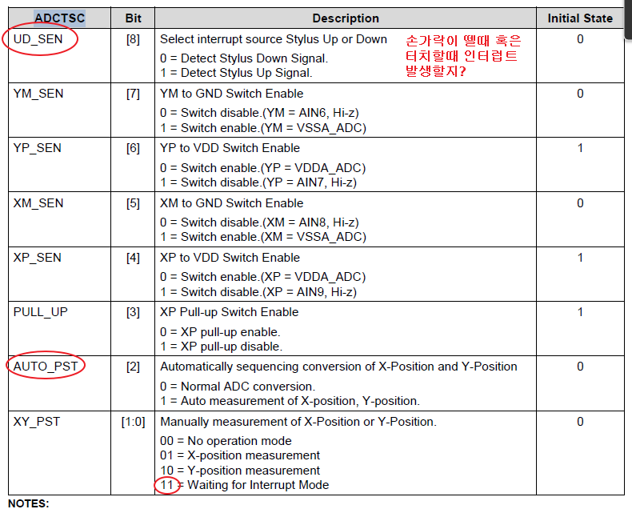

# 4일차
> mds2450 board
   
## DMA
- Direct Memory Access, 고속복사
- DMA 작동 방법
  1. DMAC 초기화  
       - 소스 : 사운드 장치, 
       - 목적지 : 메모리, 
       - 전송크기(몇 바이트를 복사할지)(byte)
       - 소스의 주소
       - 목적지 주소
       - 전송단위(1/2/4 byte)
       - 블럭전송(Burst4)(유/무)(묶어 보낼지 말지, 4바이트, 8바이트, 16바이트 단위로 묶을 수 있다는 의미)
       - 반복유무(복사가 다 끝내도 계속 반복하게 해주는...?)
       - 전송 완료 확인(인터럽트) : DMA로 전송하게 되면 cpu가 언제 끝난지 알 수 없어, 폴링, 인터럽트 방식 둘다 가능
       - SAMSUNG.2450에서 부가세팅(삼성칩에서만 국한-레지스터 제어방법)  
  2. 기다려(wait) - 주변장치  
  2'. DMA Start(Trigger) - MEM2MEM
  3. DMA 전송완료   
- DMA 전송크기 계산법
  - 전송의 크기(byte) = 단위의 크기(DSZ)(1/2/4) * TSZ(1/4) * 전송카운터(TC)(?)
  - 예시
    - 전체 크기 = DSZ * TSZ * TC
    - 480 = 4 * 1(Burst4 사용안해) * X
      - X : 120 = TC
      - 480바이트를 4바이트 단위로 TSZ(OFF), TC=120
    - 480 = 4 * 4 * X
      - X : 30 = TC
      - 480바이트를 4바이트 단위로 TSZ(ON), TC=30
- DMA : 멀티미디어나 속도가 중요한 장치에는 필수!!(LCD, SOUND)
> C언어로 만든 인터럽트 핸들러 형태
```c
 __attribute__((interrupt("IRQ"))) void DMA0_ISR(void)

```
- 메모리 대 메모리 
  - AHB : 속도가 빨라
- UART 
  - APB : 속도가 느려
  - UART의 주소가 동일한 곳에서 계속 받아온다면 
   

## Bus Interface
|IIC|SDA|
|:--:|:--:|
|I2C|SCL|
### IIC

## 터치
   
   
- ADC
  - analog to digital  
   
  - sampling 주파수

  - 압축하기에도 좋고 노이즈에도 강하다.(디지털의 강점), 센서와 밀접
   
   
  - ENABLE-1 : AD 변환 가능하게
   
AD 변환을 기다리는...?
```c
		rADCCON|=0x1;
		while(rADCCON & 0x1);
		while(!(0x8000&rADCCON));
	
```
AD 값을 변환
```c
		ADC_x=(int)(0x3ff&rADCDAT0);
		ADC_y=(int)(0x3ff&rADCDAT1);
	
```

   

## 만약 리눅스 내에 한글이 삭제되면
file - set file encoding - UTF 8로 클릭하고 SAVE!!(이미 깨진거는..안됭...미리 예방)
   
   
이게 없으면(PACKAGE가 없으면) 삭제하고 다시 설치
convertUTF 다운
~/.config/sublime-txt-3/Packages 폴더로 이동해서
git clone https://github.com/seanliang/ConverToUTF8.git
그러면 생성되서

> color 8bit(BPP), 16bit(BPP), 24bit(BPP), 32bit(BPP)
> monochrome 1bit(BPP)-BW, 2bit(BPP)-GRAY, 4bit(BPP)-GRAY
8bit(BPP)는 애매하당 - 그래서 특이한 방법을 사용, palette
16bit
  - RGB555+1
  - RGB565(그린색상을 좀더 선명하게 하기위해서 +1)
24bit(16M colors- 천육백만개의 색을 표현?)
  - RGB888
32bit(16M colors)
  - ARGB888(알파 채널 추가-투명도 역할, 자막과 화면과 겹쳐서 보게 할 때)
  - RGBA888(알파 채널이 LSB쪽에,,,?)

* 더블 버퍼링은 필수 
  * 프레임 버퍼에서 그림이 복사가 되는 도중에 lcd panel에서도 그게 보이니까 하나더 버퍼를 만들어줘 

- wget [받은 파일 링크주소]
- convert -geometry 480x272! -type truecolor (파일이름) images.bmp

   
   
   

mv EZGLGG+ bin2c.zip 
unzip bin2c.zip

- 리눅스 명령어
  - 이미지 보드 화면에 띄우기  
  112  wget http://d.pr/f/EZGlgg+  
  113  ls  
  114  mv EZGlgg+ bin2c.zip   
        -> 이름 변경  
  115  unzip bin2c.zip   
  118  convert -geometry 480x272! -type truecolor bts-grammys-1.jpg   
  120  cd bin2c\ for\ UNIX/  
  122  sudo mv bin2c /usr/bin  
  user@linux:~/Desktop/m2450/lab/student/00_base_runtime/Images/bin2c for UNIX$ cd ../  
  user@linux:~/Desktop/m2450/lab/student/00_base_runtime/Images$ bin2c  
  Usage: bin2c <binary> <destination file> <array name>  
  user@linux:~/Desktop/m2450/lab/student/00_base_runtime/Images$ bin2c myimg.bmp myimg.h myimg  
  129  subl myimg.h  

```c
// 불러올 그래픽 화일을 지정
#include "./Images/myimg.h"
....

	Show_Welcome("LCD & Touch Test");

	Lcd_Clr_Screen(BLACK);
	Lcd_Select_Frame_Buffer(0);
	Lcd_Get_Info_BMP(&xtmp, &ytmp, MYIMG);
	Lcd_Draw_BMP(((LCD_XSIZE/2)-(xtmp/2)), ((LCD_YSIZE/2)-(ytmp/2)), MYIMG); 
	Lcd_Printf(10,254, YELLOW, BLACK, 1,1,"다음단계로 넘어가려면 터미널에서 아무키나 입력하세요");

	Lcd_Select_Frame_Buffer(1);
	Lcd_Clr_Screen(BLUE);
	Lcd_Get_Info_BMP(&xtmp, &ytmp, s01);
	Lcd_Draw_BMP(((LCD_XSIZE/2)-(xtmp/2)), ((LCD_YSIZE/2)-(ytmp/2)), s01);  
	Lcd_Printf(10,254, YELLOW, BLACK, 1,1,"다음단계로 넘어가려면 터미널에서 아무키나 입력하세요");

	Uart_Printf("\n다음단계로 넘어가려면 아무키나  누르시오!! \n");
.....

```
=> 3군데 변경
