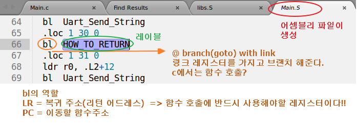

# 1일차 - 차량용 프로세서 이해 및 활용 시작
## 시험본거 정리....막쳤....
## 책하고 같이보쟝....무리ㅠㅠ.....(책그림에 필기)
## 프로세서
### 프로세서 버스
버스는 시스템의 여러 장치들을 연결하는 경로
- 내부 버스
- 외부 버스  
    1. 데이터 버스
    2. 어드레스 버스
    3. 제어 버스
## little Vs big endian
- 1. 리틀엔디언 하드웨어와 빅엔디언 하드웨어가 따로 있나?
  - yes
  -   
- 2. 컴파일러도 리틀엔디언 컴파일러와 빅엔디언 컴파일러가 따로 있나?
  - yes
  - 
  - 
    - LSB는 리틀엔디언이라는 증거?
- 우리 하드웨어는 리틀엔디언 하드웨어를 사용 

### 어셈블리어에서 
```c
#if 1
    /* Testing how to return */
    Uart_Send_String("Start How-to-return test\n");
    HOW_TO_RETURN();	// goto definition 할때 없으면 어셈블리어로 됬을것으로 추측 
        Uart_Send_String("Success\n");
#endif
```
- 파일(디렉토리) 검색 방법
  - 찾고자하는 함수? 블록 처리 후
  - ctrl + shift + f
  - 함수에 더블클릭
    -   

- 주석 처리
  - /* .... */ 
  - @ remark
- 어셈블리에서 레이블
  - 모든 변신이 가능한게 레이블, 만능!!
  - 변수, 배열등등 모두 될수있어
  - HOW_TO_RETURN:	@ 레이블 
  - 레이블 추가 정보
    - 레이블이란 인스트럭션이나 데이터의 위치를 표시해 주는 것이다. 인스트럭션의 위치를 표시해 주는 것이라는 설명에 대해서는 C에서 goto문을 생각하면 가장 쉬울 것이다. C에서는 특정 문장 앞에 L1: 과같이 쓰고, 나중에 그 위치로 옮겨가고 싶을 때 goto L1;이라고 썼다. 어셈블리에서는 jmp이나 loop와 같은 인스트럭션을 쓸 때 사용하게 될 것이다. 이러할 때 쓰이는 레이블을 코드 레이블(Code Label)이라고 한다.
    - 데이터의 위치를 표시해 준다는 것은 무엇일까? 바로 변수의 이름이다. 변수의 이름이란, 데이터 영역에 일종의 레이블을 붙여 그 위치를 기억했다가 그 변수를 사용할 때 아까 기억해놓은 레이블을 이용해서 그곳에 값을 저장하거나 불러오는데 쓰인다.
    - 만약 데이터 레이블이 없다면 우리는 특정 주소에 변수를 사용하기로 약속하고는 그 주소를 계속 외우고 다녀야 할 것이다. 또 그 변수의 역할, 갖게될 값의 형태까지 기억하려면 얼마나 불편한지 짐작이 갈 것이다. 이렇게 데이터의 위치를 기억하는 레이블을 데이터 레이블(Data Label)이라고 한다.

- 레이블(label) 작성법
  1. 알파뉴메릭(_ 포함)으로 작성 
  2. 1번 colum(열)에 작성
  3. 콜론(:)은 있을 수도 없을 수도....
- 어셈블리에서 니모닉
  - 인스트럭션 니모닉(Instruction Mnemonic)
  - 아까 인스트럭션 니모닉에 대해 잠시 언급한 바가 있다. 좀더 자세히 설명해 보자면, Mnemonic의 사전적 의미는 "기억을 도와주는 장치"이다. 1회에서 필자가 말했던 것 처럼 CPU에게 내릴 명령코드를 의미있는 글자로 치환시켜주는 것이 어셈블리어의 기본 모토라고 하였다. 복잡한 명령 코드 대신 "기억을 도와주는 것"이 바로 이 니모닉이다. 대표적인 것으로 mov, add, sub와 같은 것이 있다. mov는 move의 약자이고, sub는 subtract의 약자이니까 어떤 일을 하는 인스트럭션인지는 짐작이 갈 것이다.
```c
        .globl  HOW_TO_RETURN   /* globl : ld 에게 보이는 심볼을 만든다. */
        /* .은 지시자 */
    HOW_TO_RETURN:	@ 레이블 
```
- 주의!!!   
  - HOW_TO_RETURN:	@ 레이블   
  - [한칸 띄움]HOW_TO_RETURN:	@ 레이블   
    - 위의 차이가 있다!!!   
    - 컴파일러마다 차이가 날 수 있다.  
    - 지금 GNU 컴파일러 사용  
    - 되도록이면 TAB키 사용하지 말 것...  

## Main.S 파일 생성하는 방법
1. 컴파일 : make clean;make  
2. 컴파일 후 생성된 부분에서 main.c 부분 찾아서 ctrl + shift + c(복사) 
3. /opt/CodeSourcery/Sourcery_G++_Lite/bin/arm-none-eabi-gcc -c -I/home/user/Desktop/m2450/lab/student/01_Hello_ARM_Student -I/opt/CodeSourcery/Sourcery_G++_Lite/arm-none-eabi/lib/include -I/opt/CodeSourcery/Sourcery_G++_Lite/lib/gcc/arm-none-eabi/4.5.2/include -g -Wall -Wstrict-prototypes -Wno-trigraphs -O0 -fno-strict-aliasing -fno-common -pipe -march=armv4t -mtune=arm9tdmi -fno-builtin -mapcs -o Main.o Main.c  
4. 위의 부분을 ctrl + shift + v(붙여넣어서)
5. 아래와 같이 수정
   
6. 그 다음부터는 컴파일 해주고 계속 위의 명령을 해주면 된다. 그럼 어셈블리어 파일이 수정되고 생성?

## ~.dis 파일 생성 하는 방법
  
* makefile
  * $(OBJCOPY) $(OCFLAGS) $(TOPDIR)/MDS2450 $(TOPDIR)/MDS2450.bin
  * $(OBJDUMP) -d $(TOPDIR)/MDS2450 > $(TOPDIR)/MDS2450.dis
    * -> 주소를 알려주는 파일?
- objdump -f <filename>
  - 파일의 헤더 정보를 알려줍니다. 정보로는 파일 포맷과 아키텍처, 플래그, 시작 주소를 알려줍니다.


## 어셈블리어
- 어셈블리어 파일

- main.c 파일
```c
// 선언부
 int HOW_TO_RETURN(int,int);
/* ...... */
#if 1
	/* Testing how to return */
	Uart_Send_String("Start How-to-return test\n");
	Uart_Printf("How-to-return value :%d\n",HOW_TO_RETURN(87,877));

	// HOW_TO_RETURN(1,2,3,4,5,66,77);	// goto definition 할때 없으면 어셈블리어로 됬을것으로 추측 
	// 함수 인자는 레지스터를 이용해서 사용..
	// HOW_TO_RETURN(r0,r1,r2,r3); r 레지스터 사용, 차례대로 규칙이야!!
    	Uart_Send_String("Success\n");
#endif

```
- libs.S 파일
  
```c
	/* 
	 * int HOW_TO_RETURN(int,int);
	 * -----------------------------------------------------------------
	 */
	.globl  HOW_TO_RETURN @ 없으면 함수를 찾을 수가 없다. 
	@ .붙어있는걸 전부 지시어라고 한다. 니모닉 코드 
HOW_TO_RETURN:	@ 레이블 
	/* IMPLEMENT HERE : return ? */	
	@ mov r0,#77
	@ mov r1,r0 @ r1=r0 , mov -> copy direction
	mov pc,lr @ 리턴 명령(pc=lr)
	@ 오른쪽 에 있는게 왼쪽으로 복사된다. lr이 pc로 복사 

	/* IGNORE this branch instruction */
	b	. @while(1); @ 어셈블리어 무한 루프 
 
```
makefile
```c
	bl	HOW_TO_RETURN
	mov	r3, r0
	ldr	r0, .L2+16
	mov	r1, r3
```
    - mov pc,lr @ 리턴 명령(pc=lr)
      - LR(Link Register) : 서브루틴에서 되돌아 갈 위치 정보를 저장하고 있는 레지스터
        - 프로세서의 동작 모드마다 별도로 할당된 LR 레지스터를 가지고 있다.
      - 되돌아 갈 때 MOV 명령을 이용하여 LR 값을 PC에 저장
      - PC(Program Counter) : 프로그램을 수행하는 위치를 저장하고 있는 레지스터
    - bl : 서브루틴을 호출하는 BL 명령을 사용하면 PC 값을 자동으로 LR에 저장
    - 어셈블리어는 왼쪽에서 오른쪽으로 복사등등 순서를 생각하자!!
    - .globl 
      - .은 지시자, 니모닉 코드
      - ld 에게 보이는 심볼을 만든다. 
    - b. : B 명령어는 실행 흐름을 변경하거나 어떤 루틴을 호출하는 데 사용(?)
- 인자가 없을 때  
  
- 인자가 1개  
  
- 인자가 7개  
  

    - ex> stack 메모리 8번에 77이 저장되어 있다.  
    - r0~r3까지는 레지스터 사용하고 그 이후는 r3만 계속 사용....?  

> ATPCS(ARM/Thumb Procedure Call standard) 는 뭐더라...?

## operating 모드의 변환과 레지스터
- 책에....정리...무리.......
  
    - IRQ 가 18번지!! 

