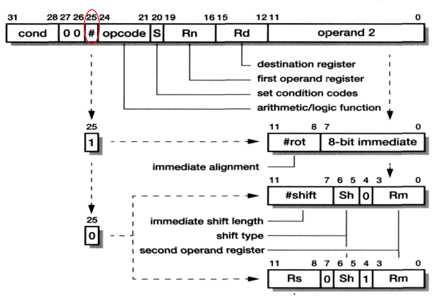
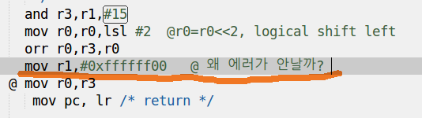

# 7일차
## Exception
- 외부의 요청이나 오류(인터럽트)에 의해서 프로그램 동작을 잠시 멈추고 프로세서의 동작모드를 변환
- 목요일에 할 계획
## 인터럽트 latency
- 인터럽트 지연시간(상식으로 용어 알아두자!!)
## 프로세서 reset과 start-up코드
- 자세한건 목요일
- 프로세서 reset
  - 프로세서에 리셋 신호가 입력되면 실행중이던 명령을 멈추고
      1. SPSR_svc에 CPSR 값을 복사
      2. CPSR 값을 변경
      3. PC 값을 LR_SVC 레지스터에 복사
      4. PC 값을 0번지로 변경(RESET VECTOR 어드레스, 0번지 코드가 읽히게 된다. 0번지에 실행되는 코드가 들어있어야된다.)
      5. RESET 핸들러로 시스템 초기화 수행
- start-up코드 : 부트코드

## Data Processing 명령과 내부 버스
|ADD|Rd,|Rs,|OP2|
|:--:|--:|:--:|:--:|
|OP 코드|Destination 레지스터|operand 1|operand 2|

|LDR|Rd,|[Rs,|Offset]|
|:--:|--:|--:|:--|
|OP 코드|Destination 레지스터|Base|Offset|
```c
ldr r3, [r0]		@r0=0x34000000 
@ 340000000 번지에서 4byte읽어온다. 
@ ldr : 로드될때 메모리에서 word 단위로 값을 가져와 
@ word : 32bit
@ half word : 16bit

ldr r3,[r0, #16]
@ *(ptr+16) 과 같아 
@ *(base+offset(?)) 과 같아 

@ ldr은 워드 단위로 읽어
@ ldrb는 한비트 단위로 읽어

```
## Multiplier와 Shifter
Multiplier : 32비트의 두 입력을 받아서 곱하여, 결과가 32비트를 넘더라도 넘는 부분은 버리고 32비트만 남긴다.  
Shifter : 바이너리 시프트

## ARM9TDMI
* 디버깅 장치가 내장되어 있다.  
### 이상적인 ARM9TDMI 파이프라인  

- 파이프 라인을 사용하면 생산성이 높아진다. 
1. FETCH : 읽어들일때
2. DECODE : 코드 해석
3. EXECUTE : 실행(shift-비트밀어주는 것, ALU-산술논리연산자(계산))
4. MEMORY : 만약 mov r0,#7과 같이 메모리 액세스가 필요없을 경우 스킵!!하여 바로 WRITE로 넘어간다. 
5. WRITE  
### LDR 명령과 interlock 사이클

* 동기를 맞추기 위해서 interlock를 추가한다. 
### Branch 명령과 pipeline 동작
> 사진이....안찾아짐....ㅜㅜ
* Branch 명령이 사용되면 
  * fetch한 명령을 모두 버리고 지정된 분기하여 새로운 명령을 읽는다. 
  * pipeline이 깨진다!! 비효율!!
* BL 0x100 명령이 실행되면 실행(E)단계에서 0x100번지 명령문을 실행하게 되면서 그사이 진행했던 나머지 패치, 디코드 단계들이 전부 버려진게 된다.
* 그리고 다시 새로 정비하는데도 시간이 걸리기 때문에 비효율적이다!! 낭비!!

## ARM9E
* ARM9E 파이프라인
  * MAC(곱셈 연산), SAT가 파이프라인에 추가

## ARM11 프로세서
* 기존까지는 기능이 많이 업그레이드 되지 않았지만 ARM11 프로세서로 업그레이드 되면서 기능이 무진장 짱 많이 추가됬따!! 그 부분은....책으로 보쟝
* 추가된 일부분 설명
  * 분기로 인해 발생한 문제해결
  * 정수형같은거 처리할 수 있게..?
  * Vectored interrupt 방식 지원
    * 기존에는 인터럽트 컨트롤러 PIC를 사용했는데 VIC로 변경!!
    * VIC가 사용하기 편해
      * 레지스터가 몇번인지 확인하거나 클리어 일일이 할 필요가 없다!!(단순화, 자동화)
  * Mixed-endian 지원
    * 소프트웨어 실행한 후에 바꿀수 있도록...? 말이 안됨 되도록 사용 x 
  * 비정렬 지원
    * 하지만 속도저하, 성능저하되므로 되도록이면 사용하지 말 것!!
    * 
```c
	/* 비정렬 엑세스 도전!! */
	char* p;
	long* pl=(long*)0x34500000;
	long vl;

	Uart_Init(115200);
	Uart_Printf("\nHello ARM Processor!!!\n\n");
	
	Uart_Printf("Before\n");
	// p=pl;p++;pl=p;	// 비정렬....?? error 1번지라서 에러 
	p=pl;p+=4;pl=p; // success 4번지니까!!
	vl=*pl;
	Uart_Printf("After(%d)\n",vl);
```  

  * 파이프라인 병렬 지원...? => 동시에 진행되는...?
    * 일반계산, 곱셈계산, 계산하면서 메모리 로드를 동시에 할 수 있다.
  * SIMD 추가
    * 
> NVIC(NESTED...??)

# ARM 프로세서의 명령어
## 32비트 ARM 명령어
* 모든 ARM 명령어는 조건부 실행이 가능하다. 
* 모든 ARM 명령은 32비트로 구성
  * Load/Store와 같은 메모리 참조 명령이나 Branch 명령에서는 모두 상대 주소방식(indirect address)을 사용
  * immdiate 상수는 32비트 명령어 내에 표시된다. 
* Load/Store 아키텍처를 사용하는데 이것은 RISC의 단점!!
  * LDR : 메모리 읽기
  * STR : 메모리 쓰기 
  * 어셈블리는 
    - LOAD/ STORE
      - RISC의 단점  
      - ```c
          mov r4,#0x???  
          mov r5,#0x??  
          ldr r0,[r4] @b  
          str r0,[r5] @c  
          ```
          하드웨어를 더 강하게 제어...  
      - SISC  
      - ```c
          mov r4,#0x???  
          mov r5,#0x??  
          mov [r5],[r4]  
          ```
            SISC가 훨씬 간편  
      - c는  
      - ```c
          int b,c;  
          b = c;  
          ```

## 16비트 Thumb 명령어
* 32비트의 ARM 명령을 16비트로 재구성한 명령
* 장점
  * 코드 크기를 ARM의 65% 줄일 수 있다.
  * ARM 명령을 수행할 때보다 성능이 우수
* 단점 
  * 조건부 실행이 안된다.
  * Immediate 상수 값이 표현 범위가 적다. 

## ARM 명령어 형식

- 조건필드 : 명령어에 "S" 접미사를 삽입하면 연산+상태 업데이트가 된다.
  - 컴퓨터가 알아서 해주므로 여기까지만 생각!!
  - 
## 조건부 실행
* ARM 장점!!
* ARM에서 모든 명령을 조건에 따라 실행 여부 결정 가능
* Branch 명령의 사용을 줄인다.
* 모든 명령어는 조건필드를 가지고 있으며 cpu가 명령의 실행 여부를 결정하는데 사용된다.
* CPSR(Current Program status register)의 조건 필드 값을 사용하여 조건을 검사 
* ADDR r0,r1,r2
  * r0=r1+r2
```c
/* 조건부 실행하기 위해 */
 	/* 
	 * int CONDITIONAL_EXECUTE(int a, int b);
	 * -----------------------------------------------------------------
	 *    r0=a, r1=b
	 *    The return value is result (r0)
	 */
	/* 
	 * GET A RESULT
	 *    if (a < b) result = 1;
	 *    else if (a > b) result = 2
	 *    else if (a == b) result 3
	 */
	.globl  CONDITIONAL_EXECUTE
CONDITIONAL_EXECUTE:
	/* IMPLEMENT HERE
	 * use CMP and MOV instruction only : 4 line
	 * result must be stored to r0 as follow ATPCS
	 */
	cmp r0,r1 /* r0가 기준 */
	blt L1	/* B 명령어는 실행 흐름을 변경하거나 어떤 루틴을 호출하는 데 사용 */
	bgt L2
	beq L3
	b _EXIT

L1:		/* 레이블 : 위치정보 저장 */
	mov r0,#1
	mov pc,lr

L2:
	mov r0,#2
	mov pc,lr

L3:
	mov r0,#3
	mov pc,lr

_EXIT:	/* 예외 처리 레이블 */
	mov r0,#-1
 	mov pc, lr	/* return */
     삭제

/* 조건부 실행 사용 */
	cmp r0,r1 /* r0가 기준 */
	movlt r0,#1 /* 조건이 맞을때만 실행, 앞에 명령어,뒤에 조건문 */
	movgt r0,#2
	moveq r0,#3
	mov pc,lr
    --> 그외의 명령어
		sublt r0,#1
    	mullt r0,#1
	    andeq r0,#1  
```

## Branch 명령어
|명령어|B,BL|Branch, Branch Link|
|:--:|:--:|:--:|
|사용예|B there|goto|
|사용예|BL sub+ROM|어드레스 계산후 서브루틴 콜|
- 브랜치 명령어 구성
  - CPSR 에서 24비트 
    - 0 : Branch
    - 1 : Branch with link
  - 분기할 주소 계산
    - pc값을 기준으로 비트 [23:0]에 해당하는 offset이 사용된다.
### subroutine 구현
* branch with link(bl) 명령
  * 다음에 수행할 명령의 위치를 lr에 저장한다.
  * lr = pc -4
    * 왜 마이너스? stack 개념....
* 서브루틴에서 return
  * lr에 저장된 주소를 pc에 옮긴다.
  * mov pc, lr
    * pc = lr
## data processing 명령어의 구조


## 산술연산, 논리연산

- 비트
  - and 연산자 : bit 지울때 사용하는 것!!  
  - or 연산자 : bit 세팅할때  
  - xor 연산자 : 서로 다른 값을 알 수 있을때, 토글...?  
  
## 비교연산, 데이터 move 명령

```c
/* #0xfffffff는 너무 큰 숫자!! */
MOVEQ r1,#0xfffffff
/* 아래와 같이 쓰면 #0xfffffff */
MVNEQ r1,#0
/* 즉, MOVEQ와 값은 같지만 32비트라는 제한이 있기때문에 필요하다!! */
MVNEQ r1,#0xff    /* 0xffffff00 */
```

## operand2와 barrel shifter

- 1단계.find OP2(3번째부터 쭉)  
- 2단계.operation(OP code)  
- 3단계.save(register write)  
- OP코드 Rd, Rs, OP2  
  - ```c  
      add r0,r0,#1  		@r0=r0+1  
      add r0,r0,r0  		@r0=r0+r0=2r0  
      add r0,r0,r0,lsl #1  	@r0=r0+2r0=3r0    // 더하기했지만 곱셈을 할 수가 있다.   
      add r0,r0,r0,lsr #1  	@r0=r0+1/2r0=1.5r0 // 오른쪽으로 비트 시프트, 나누는 효과, 정수형 연산되버렸다!!   
      add r0,r0,r0,asr #1  	@r0=r0+1/2r0=1.5r0(부호)  
      add r0,r0,r0,lsl r1  	@r0=r0+(2^r1)*r0   
            ==> 비트에 레지스터 값을 넣을 수 있어
      add r0,r0,r0,rrx  
            ==> rrx 뒤에 아무것도 적으면 안돼!!!
      ```
## 논리/산술 shift

- ASR
  - 자기값이 복제
  - 부호가 있는 값?
  - 부호를 반영
```c
mov r0,r0,lsl #2  @r0=r0<<2, logical shift left  
```
## rotate 동작
- ROR
  - 어디로든 보낼수 있어! 반시게방향으로
  - 회전수를 짝수배로!!
  - ```c
      /* 너무 큰 숫자, 들어갈 수 없어*/
      /* 에러발생하진 않아, 컴파일러하면 자동으로 ror 적용 */
      mov r0, #0xff000000
      
      /* 변형*/
      mov r0,#0xff,ror #8 /*회전수를 4비트만 할당? 짝수배...?*/
      ```
      
      
      
            
      ```c
      mov r1,#0xff00

      300013e8:	e3a01cff 	mov	r1, #65280	; 0xff00
      // ff를 3번째에 쓰여진 c인 12곱하기 2해서 24번 회전하면 ...0xff000000이 된다....?
      // 짝수 회전만 가능!
      // e3a01cff에서 
            // 처음 2번째 3이 ror 사용증거
            // 뒤에서 3번째 c가 10번 회전했다는 뜻

      mov r1,#0x7f800000
      // ---> 에러, 홀수 회전, 9회전이라서...
      // 머신코드 제약상황때문에 생겨난 일!!
      // 회전을 4비트만 할당을 해놨기때문에 .... 122페이지

      ```
      ```c
      0xfe00을 원해!  
            0x7f00 : 23비트 회전
            0111 1111 
            0xfe00을 24비트 회전하는거랑 같아!! 그래서 위에 값은 오류가 나지않아!!

            23비트 회전하면
            1111 1110

            mov r0,#0x1230, ror #24 => 잘안쓰여
            mov r0,#0xfe00 => 위와 같은 개념, 머신코드에 보면 자동으로 회전걸어서 바꿔준다. 
      ```


- RRX
  - 반시계방향으로만 돌릴수있어

## Immediate 상수
- operand 2로 immediate 상수로 사용 가능
  - 32비트 상수를 가질수 없다. 
  - 그래서 제한!!
    - 25 비트 : 1
    - ror
      - [11:8] : #rot, 회전수 4비트뿐!! 그래서 2배를 해준다!!
      - 즉, 짝수배만 회전가능
      - 나머지 [7:0] : immediate 상수
- 32 비트 상수 사용법
  - ```c
     	@ mov r0,#0x1230 @0xff000000, error
	ldr r0,=0x1230 @0xff000000
      ```
## PSR 전송 명령
- cpsr은 어셈블리 코드로만 접근할 수 있도록 했다. 
  - 접근불편, 안정성 up! 
- MSR cpsr_fsxc, r0  
  - cpsr은 32bit 레지스터지만 8bit씩 박혀있다 생각해도 되!!
  - 74페이지에서 fsxc 파악!!
  - f만 쓰고 싶으면
    - MSR cpsr_f, r0  
- MRS r0, cpsr  
- 
|MSR cpsr, r0|스페셜 레지스터(cpsr)|r0(범용 레지스터)|cpsr 쓰기 명령-mov 명령으로 치환해서 생각|
|:--:|:--:|:--:|:--:|
|MRS r0, cpsr| r0(범용 레지스터)|스페셜 레지스터(cpsr)|cpsr 읽기 명령-mov 명령으로 치환해서 생각|
- 왜 mov를 쓰면 안될까?
  - cpsr은 중요한 레지스터이기 때문에 접근이 안된다.
  - MSR, MRS만 사용해서 접근가능!


> math 라이브러리 포함
>  
>  make clean;make 해서 exception에서 -lm 추가


> Main.S 가 있으면 Maic.c가 컴파일 안된다.!! .S를 삭제해주자...

> 레이블 : 위치정보


## bl 관련 코드

```c
/* startup .S */
bl	InitStacks

300001fc <InitStacks>:

30000148:	eb00002b 	bl	300001fc <InitStacks>
//bl	300001fc를 해석한 값이 eb00002b
// 32비트안에 전부 압축해야하는데.... 제약이 생겨서...offset를 사용해서...?뭐라는겨...ㅜㅜ
// 1fc가 150번지 다음꺼를 가리키는...? 150-1fc : ac...pc+0xac...뭐얌...?
30000148:	eb00002b 	bl	pc+offset <InitStacks>
// -> pc relative addressing(상대적인 주소)
// -> indirect adddressing(상대적인 주소)
// -> absolute addressing, 지원하지 않는다. #398907 -> 값을 다 때려넣는것
// PC : 1fc
// offsdt : 0xac
// 두개를 더한게 150
```

## offset 코드
```c
bl myf1     
      @(1)lr=pc-4
      @(2)pc=pc+offset  
```
- offset : 두 번째 주소를 만들기 위해 기준이 되는 주소에 더해진 값을 의미한다.  

#### lib.S
```c
	      .globl	DATA_PROCESS2
      DATA_PROCESS2:	 
            ldr r0,=0x1230 @0xff000000
            @ mov r0,#0x1230 @0xff000000, error
```
	
#### MDS2450.dis
```c
      300013dc <DATA_PROCESS2>:
      300013dc:	e201300f 	and	r3, r1, #15
      300013e0:	e1a00100 	lsl	r0, r0, #2
      300013e4:	e1830000 	orr	r0, r3, r0
      300013e8:	e59f0214 	ldr	r0, [pc, #532]	; 30001604 <MMU_SetProcessId+0x8>
      300013ec:	e1a0f00e 	mov	pc, lr
            // 여기까지 다 실행, offset가 532(다음 실행할 주소)
            // 1604-1490=532 offset

      300013f0 <SUM_OF_DEC>:
      300013f0:	e3a03000 	mov	r3, #0
      .....
      30001604:	00001230 	.word	0x00001230

```

## 인터럽트 관련 함수
```c
disbleIRQ();  
      인터럽트 해제!!  
.....
      .globl disableIRQ  
disableIRQ:  
      MRS r0, cpsr  
      orr r0, r0, #0x80  
      MSR cpsr_c, r0  
      mov pc, lr  

      .globl enableIRQ  
enableIRQ:  
      MRS r0, cpsr  
      bic r0, r0, #0x80  
      MSR cpsr_c, r0  
      mov pc, lr  
```
