# 8일차
## 곱셈 명령어
- 잘 사용하지 않아

## load/store 명령어
* 자주 사용, 중요!!
* 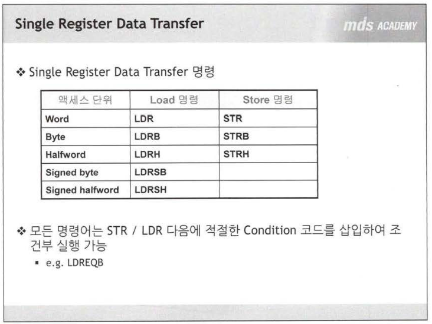
* ```c
  ldr r1, [r2,r4] // r2+r4위치의 데이터를 r1에 저장 
  ldreqb r1,[r6,#5] // 조건이 eq이면 r6+5위치의 데이터를 바이트만큼 읽어 r1에 전달
  // 단, eq는 cmp 명령어 사용후 가능!! cmp 명령없이도 가능하지만 그건 추후에 배움!! 
  str r1,[r2,r4] // r2+r4위치에 r1의 내용을 저장 
  streq r1,[r6,#5] // 조건이 eq이면 r6+5위치에 r1의 내용을 저장
  ```
* ```c
    ldr r0,[r1] /* r1=0x30100000 */
    str r0,[r2] /* r2=0x30200000 */
    ldr r0,[r1, #4] /* r1=0x30100000+4 */
    str r0,[r2, #4] /* r2=0x30200000+4 */
    mov r4,#16
    ldr r0,[r1,r4, lsl #4] /* r1=0x30100000 */
    /* 16(r4를 4로 밀어)*16 + 0x30100000 */
    str r0,[r2,r4, lsl #4] /* r2=0x30200000 */
    
    ldrb r0,[r1, #4]  /* r1=0x30100000, little endian : 30100004번지를 읽어들여 */
    /* big endian : 30100004번지... 동일행 */
    ldrsb r0,[r1, #4] /* 부호가 있는 값을 읽어 들이는 것 */
    /* sb 는 load 명령어에만 사용가능!! strsb는 없다!!*/
    
    ```
* 리틀, 빅 엔디안이어도 저장하는 곳은 0비트부터 
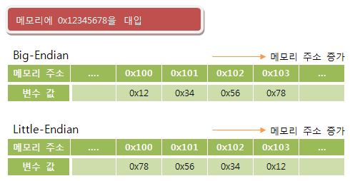
  * 즉, 저장하는 공간은 같다. 

### pre-indexed addressing mode
 ```c
    mov r4,#16

    /* auto update!!, r1=0x30100000 -> r1=0x30100004 
    #4만큼 업데이트가 된다. 주소 계산후에 접근*/
    ldr r0,[r1, #4]!

    /* r1이 업데이트 되지않아!! */
    ldr r0,[r1, #4]

    /* r2=0x30200000+4 */  
    str r0,[r2, #4] 
```

### post-indexed addressing mode
 ```c
    mov r4,#16

    /* r1=0x30100000번지에서 읽어온다!!, []안에 있는 메모리를 읽어온다!!
    메모리에 접근한 후에 #4만큼 주소 계산!!*/
    ldr r0,[r1], #0x4

    /* r2=0x30200000+4 */  
    str r0,[r2],#4
```
#### (pre and post)-indexed addressing mode
* 공통적으로 r1이 주소가 업데이트!!
* []을 기준으로 읽어주면 이해하기 쉽다!!

### relative 어드레스 지정 방식
  * ldr r0, 0x30100000 -> 0x30100000번지에서 word 단위로 읽어 들여
  * ldr r0,=0x30100000 -> 0x30100000 주소값이 들어가
  * label_1 dcd 0x12345678
  * ldr r0, label_1 -> 0x12345678번지에서 word 단위로 r0가 읽어 들여
  * ldr r0,=label_1 -> r0에 0x12345678 주소값이 들어가
  * 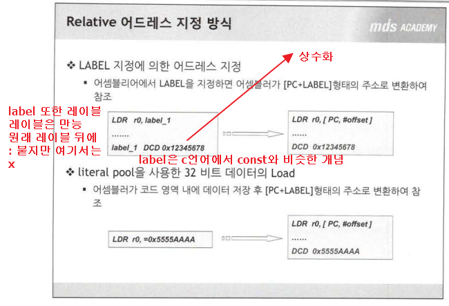

## loop
```c
while(){}
do{}while(); // 어셈블리에서는 이걸 주로 사용!!
for(;;){}
```
```c
sum_loop:
	add r3,r3,r0  /* sum */
	add r0,r0,#1	/* count */
	cmp r0, r1
	bls sum_loop

	mov r0,r3
	mov pc, lr	/* return */
```
## 실습!!
빵꾸난 이유!!  
뭐였드라.....?  
[]! 사용해서!!!  
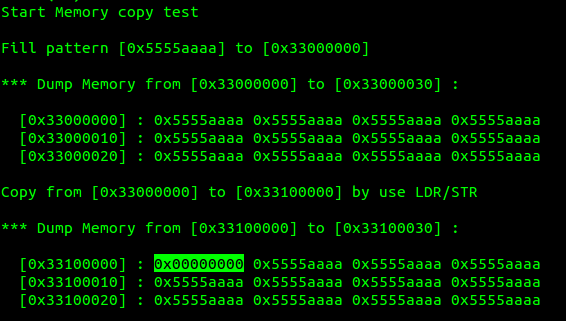

## 블럭 전송 명령
* 하나의 명령으로 메모리와 프로세서 레지스터 사이에 여러 개의 데이터를 옯기는 명령
* load 명령 : ldm
* store 명령 : stm 
* stack operation : ldm/stm 이용하여 pop, push 동작 구현
* ```c
    ldmia r0,{r4-r6,r9}  //r0 위치에서 데이터를 읽어 r4,r5,r6,r9에 저장
    ldmfd sp,{pc}^  // sp(stack point)에서 return될 위치(pc)를 읽어 pc를 update하고 cpsr을 spsr로부터 복사 
    stmia r1,{r4-r6,r9}   // r4,r5,r6,r9의 데이터를 r1에 저장 
    ```
* ```c
    // MEMCPY_SINGLE 찾아
    ldm r0,{r4,r5,r6}   // 읽기, 메모리에서 적어둔 개수만큼 읽어 들여, 3*4=12비트 읽어와
                        @읽기(r0=0x30100000)
    ldm r0,{r4-r6,r9}   // 적을게 많을때는 -하이픈 사용!!
    ldmia r0!,{r4-r6,r9}   // !는 갱신, r0가 갱신!! 16비트만큼 업데이트 +16
    ldmda r0!,{r4-r6,r9}   // !는 갱신, r0가 갱신!! 16비트만큼 업데이트 -16


    ldr r4,[r0]!
    ldr r5,[r0]!
    ldr r6,[r0]!
        @ 복사에 소요된 시간이 ldm이 훨씬 적게 걸린다!! ldm이 빨라!!
    stm r1,{r4,r5,r6}   // 쓰기, r1의 값을 r4,r5,r6가 나눠서 쓰는 것 
                        @쓰기(r1=0x30110000)
    stm r1,{r4-r6,r9}   
    stm r1!,{r4-r6,r9}   

    ```
* dma가 제일 빠르고 그다음은 ldm 

* ```c
    copy_loop_multiple:
        ldmia r1!,{r3-r8}
        stmia r0!,{r3-r8}
        sub r2,r2,#6	@ 2번 돌아 
        cmp r2, #0
        bgt copy_loop_multiple

        ldmfd sp!, {r4-r5, pc}	/* pop */
    ```
* ```c
        .globl  MEMCPY_MULTIPLE
    MEMCPY_MULTIPLE:
        stmfd sp!, {r4-r5, lr} 	/* push */
        @ stmfd나 stmdb가 똑같아...?
        @ push할 때는 stmfd나 stmdb를 사용해야...
        /* IMPLEMENT HERE */
    copy_loop_multiple:
        ldmia r1!,{r3-r5}
        stmia r0!,{r3-r5}
        sub r2,r2,#3	
        cmp r2, #0
        bgt copy_loop_multiple

        ldmfd sp!, {r4-r5, pc}	/* pop */
    ```

* ```c
        .globl  MEMCPY_MULTIPLE
    MEMCPY_MULTIPLE:
        stmfd sp!, {r4-r5, lr} 	/* push */
        @ stmfd나 stmdb가 똑같아...?
        @ push할 때는 stmfd나 stmdb를 사용해야...
        /* IMPLEMENT HERE */
    copy_loop_multiple:
        ldmia r1!,{r3-r5}
        stmia r0!,{r3-r5}
        sub r2,r2,#3	
        cmp r2, #0
        bgt copy_loop_multiple

        ldmfd sp!, {r4-r5, pc}^	/* pop, 인터럽트 핸들러 일 때만 ^를 붙일 수 있어, cpsr 복구 역할  */
    ```
* ldmia, ldmfd : 동작 같아, increment after load
* stmdb, stmfd : 동작 같아, decrement before store 
## ldm과 stm
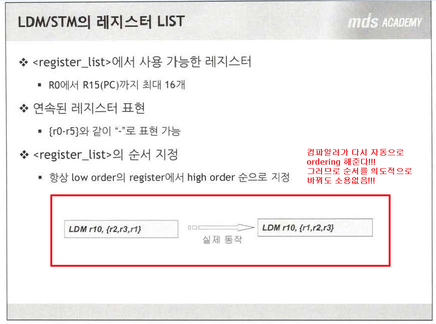
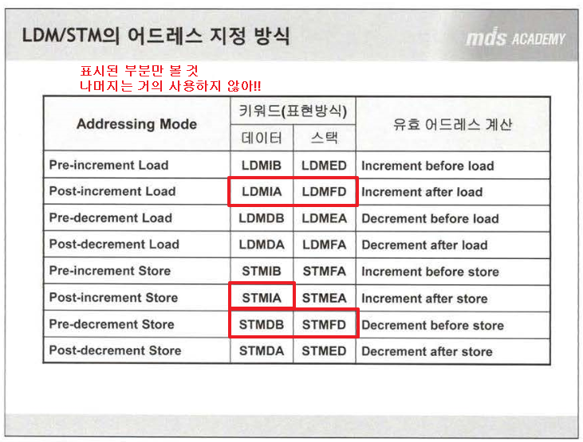
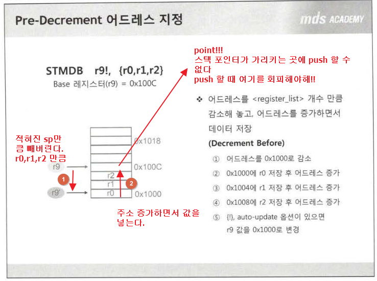
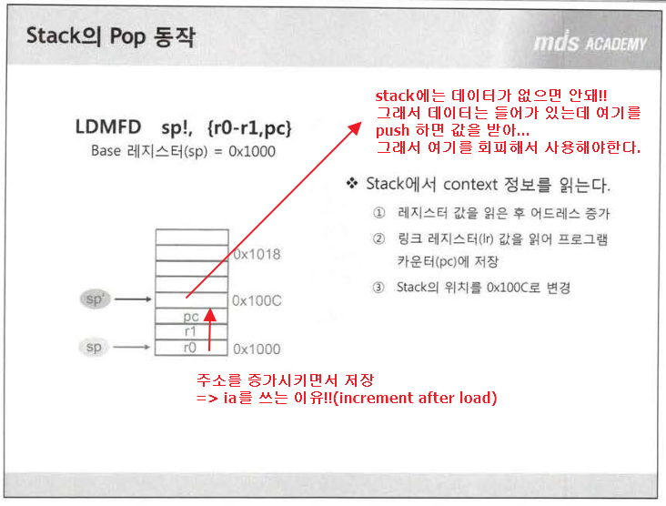

## 명령어 뒤에 s
```c
	sub r2,r2,#3	
	cmp r2, #0
```
```c
    subs r2,r2,#3	
    /* 상태가 업그레이드 되므로 cmp 명령어가 필요없다.  */
```

> APCS(Arm/Thumb P,C,S)

## 스택과 서브루틴
* ```c
        .globl  MEMCPY_MULTIPLE
    MEMCPY_MULTIPLE:
        stmfd sp!, {r4-r5, lr} 	/* push */

    copy_loop_multiple:
        ldmia r1!,{r3-r5}
        stmia r0!,{r3-r5}
        sub r2,r2,#3	
        cmp r2, #0
        bgt copy_loop_multiple

        ldmfd sp!, {r4-r5, pc} /* pop */
  ```
* 스택의 용도 중 하나는 서브루틴을 위한 일시적인 레지스터 저장소를 제공하는 것
* 서브루틴에서 사용되는 데이터를 스택에 push하고, caller 함수로 return하기 전에 pop을 통해 원래의 정보로 환원시키는데 사용
* privilege모드에서 ldm을 사용하여 pop을 할 때, 's'bit set 옵션인 '^'가 레지스터 리스트에 있으면 spsr이 cpsr로 복사된다. 
* ```c
        .globl  MEMCPY_MULTIPLE
    MEMCPY_MULTIPLE:
        stmfd sp!, {r0-r5, lr} 	/* push */
    copy_loop_multiple:
        ldmia r1!,{r3-r5}
        stmia r0!,{r3-r5}
        subs r2,r2,#3	
        bgt copy_loop_multiple

        ldmfd sp!, {r0-r5, pc}^	/* pop, 인터럽트 핸들러 일 때만 ^를 붙일 수 있어, cpsr 복구 역할  */
    ```
> ?? 인터럽트 사용할 때 ^ 사용하고 r0-r3도 같이...?

* R0,R1,R2,R3는 TEMP... 그외에는 PUSH,POP를 사용...?  
  * 함수 호출하고 ...값이 같도록 하려고...?  
  * ```c
        stmfd sp!, {r4-r5, lr} 	/* push */  
        ldmfd sp!, {r4-r5, pc}	/* pop */  
        ldmfd sp!, {r0-r5, pc}	/* pop */ -> R0이기 때문에 에러!!  
    ```
* R0-3이외에 레지스터가 오염?되면 PUSH,POP을 안쓰면 안돼!!  
* ldmfd sp!, {r0-r5, pc}^	/* pop */ -> R0이기 때문에 에러!!  
* 인터럽트 핸들러이면 r0-r3도 무시하면 안된다!!! 
* 오염된 것 만 적는게.... 포인트....  
### lr의 한계
뭐가 있었...?기억이....안나....ㅜㅜ
## swap 명령
```c
    swap r0,r1,[r2]     // 1. r2가 지정하는 word 어드레스에서 데이터를 읽어 r0에 기록
                        // 2. r1을 r2의 어드레스에 저장
    swap r0,r0,[r2]     // 값 변환!! 
```
## arm코드와 thumb 코드
* boot 코드 같은건 반드시 arm으로 컴파일러 
* thumb 명령어 형식에는 cond 없어!! 그래서 조건문 실행이 안된다. 
* 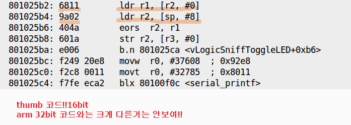
  
### BX 명령어!!
* Branch and exchange : goto 하는데 동작모드(arm, thumb)를 바꾼다
* 프로세서의 state 변경 명령 
* arm 코드 실행하다 thumb 코드를 실행할 때 사용
* ```c
    bx r0+1 // r0가 지정하는 위치로 분기하고, thumb state로 변환
    bx r0 // r0가 지정하는 위치로 분기하고, arm state로 변환, 이때 비트 0은 0
    // +1은 thumb , +0은 arm 상태롤 변환, 위의 r0에 +0이 생략
  ```
## thumb 명령 변환하는 방법
> 추가!! 149pg


## 기본적인 함수 형태
```c
	.globl  getIntNum
getIntNum:
	stmfd sp!,{r4-,lr}


	ldmfd sp!,{r4-,pc}
```
## arm 아키텍처와 프로세서
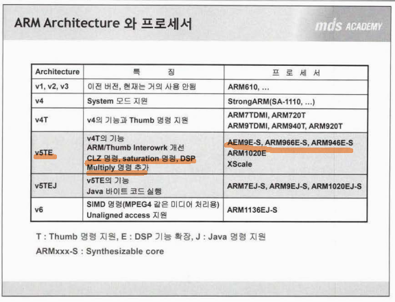
## 버전 변경!!(5lte 명령어)
* clz의 경우 arm 아키텍처에서 보면 5lte 버전에만 있다!!
* clz : msb로 부터 최초 1이 나타내는 위치 검색!! 
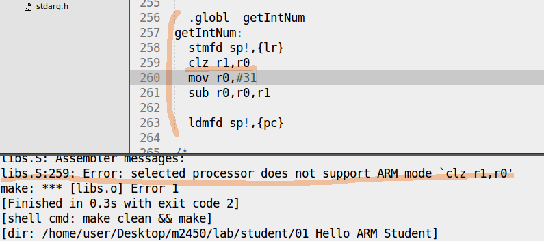

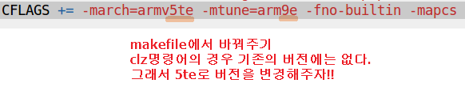
* saturate 연산
  * 분수 연산 지원...잘 모르겠...
* doubleword 단위 ldr/str
  * destination 레지스터는 2개씩 사용되는데, 짝수 번호로 시작하는 레지스터로 지정하면 다음 레지스터와 한쌍을 이룬다.
    * r0,r2,r4,r6,r8,r10,r12로 지정
* blx 명령 추가(branch with link and exchange)

## cache arm 프로세서 
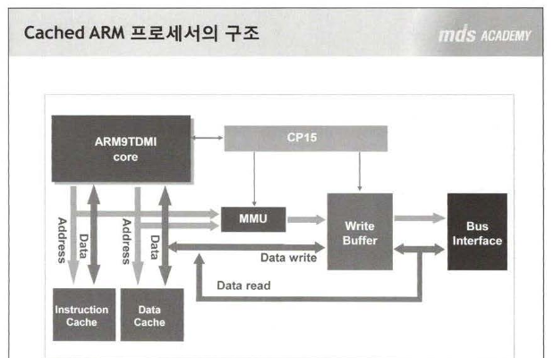  
* 코프로세서의 역할
  * mmu on/off
  * 캐시메모리 on/off 등등
  * cp15가 코프로세서 제어 내장(32비트)
* 명령어 캐시와 데이터 캐시에 어드레스와 데이터 선이 따로 연결된 것이 하바드 설계방식
  * 인스트럭션 캐시에 명령어를 읽을 때 데이터 캐시에 쓸 수 있어서 쓸 수가 있어서 성능이 매우 우수
* 주로 코프로세서 어셈 명령어로 mmu나 캐시 메모리를 동작하게 된다.
* 코프로세서 레지스터에서 cr레지스터에서 중요 비트 I,C,M만 주목, I:Instruction cache, C:data cache, M:MMU 들을 on/off 할 수 있다.
* 
* 여기서 중요한 사실! 캐시 메모리는 M비트가 반드시 ON이 되어야지 캐시 메모리를 사용할 수가 있다. 그림에서 I-Cache, D-Cache 어드레스가 모두 엠엠유로 연결되어 있기 때문
* mmu 가 off 될 경우 cpu가 메모리 주소에 접근, mmu 가 on 일 때는 가상주소로 접근
* 가상주소를 메모리 물리적 주소로 매핑하기위한 어드레스 테이블이 필요 => mmu pagetable라고 한다. 
  * 이렇게 가상주소가 확보가 되면 개발자는 i-cache,d-cache 사용 유무를 결정할 수가 있다. 

## 캐시 메모리
* 캐시 메모리는 두 가지로 구별
* 캐시 메모리는 용량이 작으며 매우 비싸
* instruction cache memory
  * 메인 프로그램에 해당되는 실행코드를 저장하는 공간
* data cache memory 
  * 데이터를 읽거나 저장할 때 사용
* 두 가지 캐시 모두 히트, 미스 모두 같은 방식
* 캐시 히트 : cpu 입장에서 캐시메모리에 실행하고자 하는 실행코드가 있을 때
* 캐시 미스 : cpu 입장에서 캐시메모리에 실행하고자 하는 실행코드가 없을 때
  * 미스가 나면 메모리에서 실행코드를 읽어들이고 다시 캐시메모리에 올린다.
  * 미스가 많으면 성능 저하 
* 두 가지 캐시 차이점
  * 데이타 캐시 읽거나 저장할 때 두 가지 방식으로 동작
    * write through
      * cpu가 캐시메모리와 메모리에 동시에 저장하는 방식
      * 캐시 메모리가 메모리와 값이 불일치가 일어났을 경우 동시에 변경, 속도 저항, 비용 증가
    * write back
      * 캐시 메모리에 우선 저장하고 메모리에는 나중에 저장하는 방식
      * 캐시 메모리가 메모리와 값이 불일치가 일어났을 경우 캐시메모리에만 변경, 속도 빨라, 어차피 나중에 자동으로 업데이트?
* 캐시의 기본 원리
  * 1. 공간 참조
      * 만약 int start, end, sum; 과 같이 선언되어 있을 경우
        * start 변수 miss 났다 해서 start만 읽을면 낭비..? 더 효율적으로 end, sum까지 왕창 읽어와..?
  * 2. 시간 참조 : 머지않은 시간내에 또 호출(loop같은..?)
* 캐시 플러시 : valid된 곳을 전부 '0' => 비워버린다. 무효처리
  * 캐시 미스가 계속 일어나면서 동기화..?
  * 캐시 내용과 메모리 내용이 다른경우 캐시를 비우고 새로 데이터를 메모리에서 읽어와야한다. (기존것은 버리고... 청소)
* 캐시 클린 : dirty flag(?)가 표시된 곳을 메모리에 전부 update!!(캐시 플러시와 반대 개념이라 생각?)
* dirty bit(flag?)를 계속 기록해둬야 해, 어디가 수정됬는지 알 수가 있어야 하니까
* 캐시 메모리란 캐시라인 모아놓은 거라고 봐도 무방
  * 캐시라인마다 태그 => valid 표시해놔, 그리고 dirty bit(data에만) 오염됬음을 데이터가 변형됬다는 순간을 표시
  * 캐시라인은 캐시가 관리하는 최소한의 데이터 단위
* 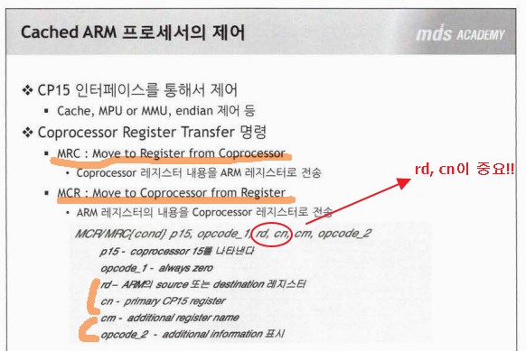  
* 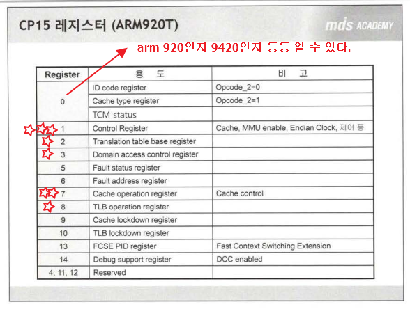  

## MMU
* 2가지 기능
  * 1. 메모리 보호 : 가상화 주소가 활성화 될 때, 권한이 없으면 메모리에 접근 못하게 할 수 있다.
  * 2. 어드레스 변환
* MMU 없이는 캐시가 존재할 수 없다.
* MMU는 코프로세서를 통해 제어할 수 있다.
* 암 코어가 코프로세서를 제어하는 명령어는 두가지
  * MCR : 암코어레지스터 값을 코프로레지스터로 쓰기 명령
  * MRC : 코프로레지스터 값을 암코어레지스터 읽어오는 명령
* MMU ENABLE하기 위해 코프로세서 레지스터중 CR 레지스터 C1을 제어
* MMU ENABLE하기 전에 해야할 3가지
  * 1. MMU 페이지 테이블이 위치할 주소를 지정
    * MMU 페이지 테이블 : 가상 주소를 물리적 주소를 변환하는 테이블
      * 개발자가 반드시 주소 지정을 해야한다.
    * 이 테이블 위치를 알려주기 위해서는 코프로세서 레지스터중에 TTB레지스터(c2)가 사용
      * mcr p15,0x0,r0,c2,c0,0x0 
  * 2. 가상 주소와 물리 주소 설정을 해야한다. 
    * 테이블 시작 주소를 알려줬으니 가상 주소를 물리 주소로 변환 시키는 설정이 필요
    * MMU_SetMTT(0x00000000,0x07f00000,0x00000000,RW_NCNB);
      * 가상번지 첫, 가상번지 끝, 물리주소 번지, 속성 00~07f~ 128메가
      * 속성은 퍼미션과 캐시에 관련 
    * ```c
        // MMU INIT
        MMU_SetMTT(0x00000000,0x07f00000,0x00000000,RW_NCNB); //bank0
        /* 가상번지 첫, 가상번지 끝, 물리주소 번지, 속성 00~07f~ 128메가  */
        MMU_SetMTT(0x08000000,0x0ff00000,0x08000000,RW_NCNB); //bank1
        /* RW_NCNB : 캐시 사용x , 캐시 오프 : 어떤 때 쓰라고?*/
        MMU_SetMTT(0x10000000,0x17f00000,0x10000000,RW_NCNB); //bank2
        MMU_SetMTT(0x18000000,0x1ff00000,0x18000000,RW_NCNB); //bank3
        MMU_SetMTT(0x20000000,0x27f00000,0x20000000,RW_NCNB); //bank4
        MMU_SetMTT(0x28000000,0x2ff00000,0x28000000,RW_NCNB); //bank5
        
        MMU_SetMTT(0x28000000,0x2ff00000,0x28000000,RW_CB); //bank5
        /* RW_CB라고 캐시를 활성화 시키라고 해야해!! 그럼 그 지정된 영역이내에 것은 2,12비트 그거 사용할 수 있어
        그 외에 것은 아무리 활성화해도 소용없어!!*/
        /* 0x28000000에서 280 3바이트만 사용... */
    ```
* 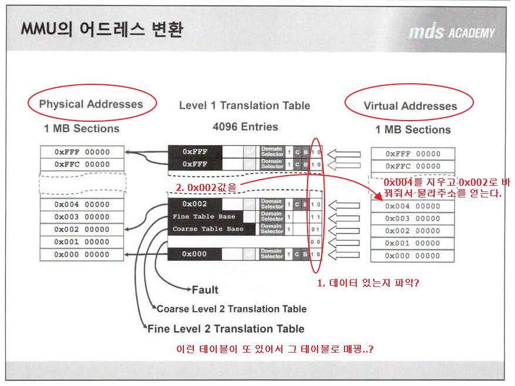
* 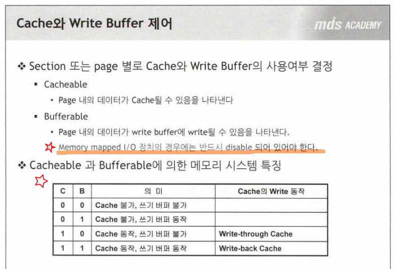   
   
* 코프로세서 레지스터 제어 방법
```c
	/* 코프로세서 레지스터를 읽는, READ */
    mrc  p15,0,r0,c1,c0,0
    /* 코프로세서 레지스터를 쓰는, WRITE */
	mcr  p15,0,r0,c1,c0,0
    /* 암코어 R0레지스터 값을 코프로세서 C1레지스터에 쓰기 */
    /* 3블럭으로 나눌 수 있어
        1. p15,0
        2. r0
        3. c1,c0,0 
        2,3(c1)이 알짜배기!
        mrc는 c1이 r0 복사
        mcr는 r0가 c1에 복사
        */
```
## cache 실습
```c
	MMU_EnableMMU();
	//MMU_EnableICache();	/* cache 사용 */
	MMU_DisableICache();
	//MMU_EnableDCache(); /* IMPORTANT : DCache should be turned on after MMU is turned on. */
	MMU_DisableDCache();
	// DCache가 효과적이다. 
```
```c
	/* 
	 * void MMU_EnableICache(void)
	 * -----------------------------------------------------------------
	 */
	.globl MMU_EnableICache
MMU_EnableICache:
	/* IMPLEMENT HERE */      
	mrc  p15,0,r0,c1,c0,0
	orr  r0,r0,#R1_I    /* 어떤 비트를 1로 만들겠다. */
	mcr  p15,0,r0,c1,c0,0
	mov	 pc,lr
```


```c
	/* 
	 * void MMU_InvalidateIDCache(void)
     Invalidate : 캐시를 전부 무효화 시켜주는....? 
     void가 이상해, r0에 쓰레기 값이 들어가 있어
	 * -----------------------------------------------------------------
	 */
	.globl MMU_InvalidateIDCache
MMU_InvalidateIDCache:
	mcr  p15,0,r0,c7,c7,0
    /* 위와 같은 경우는 특별히..뒤에 c7,0을 다른 방식으로 해석해야해.... */
    /* rm,op2라고 해... */
	mov	 pc,lr
```
### MMU INIT
```c
    void MMU_Init(void)
    {
        unsigned long i,j;
        //========================== IMPORTANT NOTE =========================
        //The current stack and code area can't be re-mapped in this routine.
        //If you want memory map mapped freely, your own sophiscated MMU
        //initialization code is needed.
        //===================================================================

        MMU_DisableDCache();
        MMU_DisableICache();

        //If write-back is used,the DCache should be cleared.
        for(i=0;i<64;i++)
        for(j=0;j<8;j++)
                MMU_CleanInvalidateDCacheIndex((i<<26)|(j<<5));
        MMU_InvalidateICache();
        
        MMU_DisableMMU();
        MMU_InvalidateTLB();

        /* MMU_SetMTT(int vaddrStart,int vaddrEnd,int paddrStart,int attr) */
        MMU_SetMTT(0x00000000,0x07f00000,0x00000000,RW_NCNB); //bank0
        /* 가상번지 첫, 가상번지 끝, 물리주소 번지 */
        MMU_SetMTT(0x08000000,0x0ff00000,0x08000000,RW_NCNB); //bank1
        MMU_SetMTT(0x10000000,0x17f00000,0x10000000,RW_NCNB); //bank2
        MMU_SetMTT(0x18000000,0x1ff00000,0x18000000,RW_NCNB); //bank3
        MMU_SetMTT(0x20000000,0x27f00000,0x20000000,RW_NCNB); //bank4
        MMU_SetMTT(0x28000000,0x2ff00000,0x28000000,RW_NCNB); //bank5
        
        /* 
        * USER WILL TEST WITH BANK 6
        * the each attribute value such as RW_CB, RW_NCNB, .... was decleared on libc.h
        *
        * 1. Please IMPLEMENT MMU_SetMTT function
        */
        MMU_SetMTT(0x30000000,0x31f00000,0x30000000,RW_CB);   //bank6-1, TEXT/DATA
        MMU_SetMTT(0x32000000,0x33e00000,0x32000000,RW_CB);  //bank6-2, TEST DATA,LCD FrameBuffer
        MMU_SetMTT(0x33f00000,0x33f00000,0x33f00000,RW_CB);   //bank6-3
        MMU_SetMTT(0x38000000,0x3ff00000,0x38000000,RW_NCNB); //bank7
        
        MMU_SetMTT(0x40000000,0x5af00000,0x40000000,RW_NCNB);//SFR+StepSram    
        MMU_SetMTT(0x5b000000,0xfff00000,0x5b000000,RW_FAULT);//not used

        /* 
        * 2. Please IMPLEMENT MMU_SetTTBase function : libs.S 
        */
        /* _MMUTT_STARTADDRESS : r0의 테이블 주소? */
        MMU_SetTTBase(_MMUTT_STARTADDRESS);
        
        /* DOMAIN1: no_access, DOMAIN0,2~15=client(AP is checked) */
        MMU_SetDomain(0x55555550|DOMAIN1_ATTR|DOMAIN0_ATTR); 

        MMU_SetProcessId(0x0);
        MMU_EnableAlignFault();

        /* 
        * 3. Please IMPLEMENT MMU_EnableMMU,MMU_EnableICache and MMU_EnableDCache
        *     : libs.S 
        */
        MMU_EnableMMU();
        MMU_EnableICache();	/* cache 사용 */
        //MMU_DisableICache();
        MMU_EnableDCache(); /* IMPORTANT : DCache should be turned on after MMU is turned on. */
        //MMU_DisableDCache();
        // DCache가 효과적이다. 
    }   
```