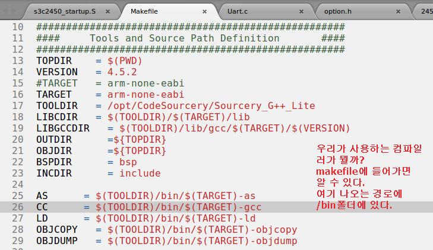

# 9일차
## cache memory
1. I-Cache / D-Cache 활성화 방법
2. Memory Mapped I/O D-Cache 비활성화
3. Cache Clean 과 Cache Flush (Invalidate)
   1. 여기서 캐시는 D-Cache를 의미
   2. 데이터가 수정되면 자연스럽게 업데이트 되는데 강제로 업데이트 하고 싶으면 cache clean 
   3. cache flush를 캐시 메모리에 들어가있는 값을 무효화 시키는 것(invalidate)
* 주의!! dma를 사용할 때는 d-cache를 off 시켜놓고 사용해야해!!
  * 왜?

## mmu
1. 링커(linker) 스크립트 파일에서의 주소 표현
    
2. 예외처리(exception) 벡터 테이블
3. 보호된 메모리 접근 -> data abort(소프트웨어가 죽어버려)
4. 존재하지 않는 가상 메모리 접근 -> data abort, 소프트웨어가 죽지는 않고 쓰레기값가져옴

* mmu는 상대 주소로 분기(몇바이트 떨어졌는지에 따라 이동..?)
  * main.c에서 mmu_init()전까지 0xC0000000의 주소는 아무 의미 없어...
  * mmu_init() 전까지는 0xc000번지는 물리적 주소? 
  * cpu는 그 주소가 물리적 주소인지 가상 주소인지 몰라, 그냥 주소만 던지는 것일뿐
  * Linker Script(가상 주소를 0xC0000000로 변경해보자, 원래는 0x30000000)
    * ```c
        MEMORY
        {
            CODE (rw)    	: ORIGIN  = 0xC0000000, LENGTH = 0x04000000
            _ISR_START(rw) 	: ORIGIN  = 0x33ffff00, LENGTH = 0x00000100
        }
        ```
  * MDS2450.dis(컴파일 하면? 아래와 같이 _start에 자동적으로 변환)
      * ```c
        c0000000 <_start>:
        c0000000:	ea00002a 	b	c00000b0 <ResetHandler>
        c0000004:	ea000011 	b	c0000050 <HandlerUndef>
        c0000008:	ea000016 	b	c0000068 <HandlerSWI>
        c000000c:	ea000021 	b	c0000098 <HandlerPabort>
        c0000010:	ea00001a 	b	c0000080 <HandlerDabort>
        c0000014:	eafffffe 	b	c0000014 <_start+0x14>
        c0000018:	ea000006 	b	c0000038 <HandlerIRQ>
        c000001c:	eaffffff 	b	c0000020 <HandlerFIQ>
        ```
  * libc.c(가상주소와 물리주소 매핑)
      * ```c
        MMU_SetMTT(0x00000000,0xfff00000,0x30000000,RW_NCNB);//not used
        ```
  * 리눅스 명령어(dis 파일 생성)
    *  arm-eabi-objdump -d MDS2450 > MDS2450.dis
## tcm이란
    *  캐시 처럼 속도가 빠르고 용량이 작은 메모리
    *  일부분의 cpu 접근하면 속도가 높아진다. 
    *  주메모리에서 지정한 부분에 접근할 경우 속도가 빨라!!
       *  자주 쓰는 LOOP같은 반복문 OR 연산이 많은 코드를 주로 지정 
## lock time
- pll lock time
  - 부팅 후 pll이 안정화 될 때까지 대기하는 시간 설정


### clock 관련 


## 어셈블리 코드로 클럭 변경하는 법


- 600M로 만들기위해 MDIV : 300, PDIV : 3, SDIV : 1


- 240M으로 변환


- 파워 관리

- 왜 메모리가 0X30000000번지일까?
  
  
  
  
  
  - 최근에 사용되는 에스디램은 대부분 디디알 에스디램(DDR SDRAM)
  - 에스디램이 하는 역할은 임베디드 시스템이 동작을 할 때 프로그램을 수행하며 주기적으로 변하는 데이타를 저장하거나 읽기를 하는 일
- 내가 사용하고 있는 컴파일러는?
  


  - arm-eabi-gcc : 펌웨어 만들 때
  - arm-linux-gnueabihf-gcc : 리눅스 커널 컴파일, 리눅스에서 러닝하는 어플리케이션에 대한 컴파일러


- BSP : 보드 지원 패키지 
  - 보드(하드웨어)를 동작시키기 위해 필요한(임베디드) 소프트웨어 묶음 

## 예외 처리 복귀 
1. pc값을 복원
2. spsr을 cpsr에 복원
* 위의 두 과정이 동시에 이루어져야한다!!
* 이런 이유로 예외 처리에서 복귀하는 동작을 하나의 명령으로 처리하기 위하여 2가지 명령을 사용할 수 있다.
  * 데이터 처리 명령과 S접미사 사용
    * 데이터 처리명령에 S접미사를 사용하고 pc를 대상 레지스터로 지정하면 cpsr 값이 복원되면서 pc도  lr을 이용하여 계산
    * SUBS PC, LR, #4
    * MOVS PC, LR
  * LDM 명령과 ^사용
    * 예외 처리가 끝날 때 스택에 저장되는 범용 레지스터 복원도 사실상 같이 이루어진다.
    * 스택에서 POP 하는 경우 ARM은 보통 LDM명령을 주로 사용
    * 레지스터 리스트에 PC가 있고 레지스터 리스트 뒤에 ^을 사용
    * LDM SP!, {R0,R1,R2,PC}^
### ARM의 모든 예외 처리에서 복귀하는 방법
1. 리셋 예외 처리 : 리셋 신호가 입력될 때
   - 별도의 반환 동작 X
2. 언디파인드 예외 처리 : 정의되지 않은 명령 수행, 코프로세서 응답X
3. 소프트웨어 인터럽트 예외 처리 : 사용자 요청에 의해 발생
   - MOVS PC, LR 
4. 프리페치 어보트 예외 처리 :
   - SUBS PC, LR, #0X4  
5. 데이터 어보트 예외 처리 : 잘못된 어드레스 공간에서 데이터를 읽거나 쓰려고 할 때
   - SUBS PC, LR, #0X8 
6. IRQ
7. FIQ
  - SUBS PC, LR, #0X4

## 유저가 코프로세서 접근권한이 없을 때
* 유일한 방법?
  * 예외 처리에서 SWI와 IRQ는 인터럽트로 발생될 경우 특권모드로 변경!!
  * 즉, 인터럽트를 불러서 접근할 수 있다.?


## 링크 스크립트
```c
  OUTPUT_FORMAT("elf32-littlearm", "elf32-bigarm", "elf32-littlearm")
  OUTPUT_ARCH(arm)
  ENTRY(_start)     // 함수 _start를 프로그램의 맨앞에 배치하고 할 때 ENTRY()지시어를 사용!!

  /* Memory Definitions */
  __TEXT_START__ = 0x30000000;
  _ISR_START = 0x33ffff00;
  _STACK_SIZE = DEFINED(_STACK_SIZE) ? _STACK_SIZE : 0x2000;
  _HEAP_SIZE = DEFINED(_HEAP_SIZE) ? _HEAP_SIZE : 0x200000;

  /* Section Definitions */
  SECTIONS
  {
    /* first section is .text which is used for code */
    .text __TEXT_START__ : 
    {
      __TEXT_START__ = .;
      *startup.o (.text)
      *(.text)      // *(.text) : 와일드 카드, 모든 텍스트를 여기로 가져와라...?
      __TEXT_END__ = .; 
      . = ALIGN(4);    // 4의 정수배로 정렬?
    }
    
    /* .rodata section which is used for read-only data (constants) */
    .rodata :
    {
      __RODATA_START__ = .;
      *(.rodata)
      *(.rodata.*)
      __RODATA_END__ = .;
      . = ALIGN(4);    
    }

    /* .data section which is used for initialized data */
    .data :
    {
      __DATA_START__ = .;
      *(.data)
      *(.data.*)
      __DATA_END__ = .;
      . = ALIGN(4);
    }  
    
    /* .bss section which is used for uninitialized data */
    .bss :
    {
      __BSS_START__ = .;
      *(.bss)
      *(.bss.*)
      __BSS_END__ = .;
      . = ALIGN(4);
    } 

    .heap (NOLOAD) : {
      . = ALIGN(16);
      _heap = .;
      HeapBase = .;
      _heap_start = .;
      _start_heap = .;
      . += _HEAP_SIZE;
      _heap_end = .;
      HeapLimit = .;
      PROVIDE( __cs3_heap_start = _start_heap);
    }

    .int_vec  _ISR_START : 
    {
        s3c2450_startup.o(int_vect)
    } 

    _end = .;
    __end = _end;
    PROVIDE(end = .);

  }
```
* 스택부분은 없다!! 사용자가 관리 

## startup.S
```c
...
	/* CONFIG_CLK_534_133_66	*/
	.equ	Startup_MDIV,			267
	.equ	Startup_PDIV,			3
	.equ	Startup_SDIV,			1
	.equ	Startup_EPLLSTOP,		0
	.equ	Startup_ARMCLKdiv,	0
	.equ	Startup_PREdiv,		0x1
	.equ	Startup_HCLKdiv,		0x1
	.equ	Startup_PCLKdiv,		1
	
	.equ	CLK_DIV_VAL,	((Startup_ARMCLKdiv<<9)|(Startup_PREdiv<<4)|(Startup_PCLKdiv<<2)|(Startup_HCLKdiv)|(1<<3))
	.equ	MPLL_VAL,	((Startup_EPLLSTOP<<24)|(Startup_MDIV<<14)|(Startup_PDIV<<5)|(Startup_SDIV))
	.equ	EPLL_VAL,	(32<<16)|(1<<8)|(2<<0)
	
	/* macro 정의*/
	.macro HANDLER, HandlerLabel, HandleLabel
\HandlerLabel:
	sub		sp,sp,#4		/* decrement sp(to store jump address) */
	stmfd	sp!,{r0}			/* PUSH the work register to stack(lr doesn`t push because */ 
						   	/* it return to original address) */
	ldr		r0,=\HandleLabel	/* load the address of HandleXXX to r0 */
	ldr		r0,[r0]         		/* load the contents(service routine start address) of HandleXXX */
	str		r0,[sp,#4]      	/* store the contents(ISR) of HandleXXX to stack */
	ldmfd	sp!,{r0,pc}     	/* POP the work register and pc(jump to ISR) */
	.endm

	.text
	.globl _start  // .globl은 다른 파일에서도 함수나 변수를 사용하도록 하는 지시어
                // 초기화 파일에서는 시작하려는 위치에 임의의 이름을 가지는 함수를 지정
_start:
	b	ResetHandler    // reset 벡터는 0x00 번지?
	b	HandlerUndef			/* handler for Undefined mode */ // 그 다음부턴 0x04번지
	b	HandlerSWI			/* handler for SWI interrupt */ // 0x08번지..
	b	HandlerPabort			/* handler for PAbort */
	b	HandlerDabort			/* handler for DAbort */
	b	.						/* reserved */
	b	HandlerIRQ				/* handler for IRQ interrupt */   // 0x18번지 
	b	HandlerFIQ				/* handler for FIQ interrupt */
  // FIQ는 부트코드에서 제일 마지막에 있기때문에, 그 밑에 HandlerFIR: 바로 사용하게되서 빠른...?

...
	/* Reset Handler */
	.globl ResetHandler
ResetHandler:
	ldr	r0,=WTCON		/* watch dog disable  */
	ldr	r1,=0x0         
	str	r1,[r0]
...
	
	/* Set memory control registers */
       ldr	r0,=SMRDATA
	ldr	r1,=BANKCFG	/* BANKCFG Address (Start Address) */
	add	r2, r0, #20		/* End address of SMRDATA => total registers = 20/4 = 5개 */
0:
	ldr	r3, [r0], #4   	/* post increment */
	str	r3, [r1], #4  	/* post increment */
	cmp	r2, r0
	bne	0b    // 0b란 조건이 일치할 경우? 0:이 쓰여진 제일 가까운 before로!!
  // 만약 3f라면 3:이 쓰여진 가장 가까운 forward로!!
...

	.globl IsrIRQ
IsrIRQ: 
        sub     sp,sp,#4       //reserved for PC
        stmfd   sp!,{r8-r9}   
        // 이 경우는 호출하는 함수에서...뭔가를 써야? __attribute__ 그거...?
/*
  IRQ_Handler:
    sub lr,lr,#0x4    // 되돌아갈 주소 계산
    stmfd sp!,{r0-r12, lr}    // push
    bl  do_IRQ            // 인터럽트 번호를 인수로 do_IRQ 호출
    ldmfd   sp!, {r0-r12, pc}^  // pop 하면서 cpsr값 복원 
    // 위와 다른거 차이점 분석하기!!
*/
...

end_off: // generic interrupt
        ldr     r8,[r8]
        str     r8,[sp,#8]
        ldmfd   sp!,{r8-r9,pc} 

abt_return: // no interrupt
	 sub lr,lr,#4
        str   lr,[sp,#8]
        ldmfd   sp!,{r8-r9,pc}^ // 인터럽트가 아니어서??...^를 언제 써야할지 확실하게 모름..ㅜ
...
	
	orr	r1,r0,#Mode_ABT|NOINT             // ABORT 모드값 지정
	msr	 cpsr_cxsf,r1		/* AbortMode */   // ABORT 모드로 변환
	ldr	sp,=AbortStack                    // ABORT 모드 스택 설정 

	orr	r1,r0,#Mode_IRQ|NOINT
	msr	 cpsr_cxsf,r1		/* IRQMode */
	ldr	sp,=IRQStack
    
	orr	r1,r0,#Mode_FIQ|NOINT
	msr	 cpsr_cxsf,r1		/* FIQMode */
	ldr	sp,=FIQStack
...
```
### IRQ 핸들러 구현 예
```c
  IRQ_Handler:
    sub lr,lr,#0x4    // 되돌아갈 주소 계산
    stmfd sp!,{r0-r12, lr}    // push
    bl  do_IRQ            // 인터럽트 번호를 인수로 do_IRQ 호출
    ldmfd   sp!, {r0-r12, pc}^  // pop 하면서 cpsr값 복원 
```
## reset 예외
  - por(파워온리셋)
  - h/w 리셋(리셋 스위치 입력)
  - wdt 리셋
  - * s/w 리셋(cpu 마다 달라, 레지스터에 값을 기록하면 그때 사용하는...?)
  - pc=30000000(리셋이라 부르긴 그렇지만...우리가 만든 코드를 처음부터 실행하도록)

## arm exception
  - prefetch abort & data abort
    - 1. *비정렬 액세스(data abort only)
    - 2. 보호된 메모리 액세스 : 특권모드에 유저모드가 접근하려고 할 때
    - 3. 존재하지 않는 가상 메모리 액세스 : 레코드를 만들어 놓았지만 어떤 가상 메모리와도 연결이 안됐으면 존재하지 않아서 abort
    - abort는 부정적인 것!

## b라는 명령어 외에도
mov pc,#ResetHandler  
ldr pc,=ResetHandler  
이렇게 사용이 가능하다.  

## FIQ가 IRQ보다 빠르게 처리되는 이유
1. 파이프라인 파괴가 되는 것을 방지할 수 있다.
   1. 부트코드에서 제일 마지막에 있기때문에, 그 바로 밑에 HandlerFIR:사용하면 된다.
2. 우선순위(2)가 IRQ보다 높다
3. Private 한 레지스터(컨텍스트 저장/복원이 필요없는)가 5개 존재(r8~r12)

## 용어
- 포팅
  - 보드에 대해서 구동될 수 있도록 되어있지 않은 코드를 수정해서, 보드에서 동작될 수 있도록 만들어 가는 과정 
  - 바이너리를 실제 보드에 다운로드해서 보드에서 구동되는 것
- bic : bit clear
- pll lock time : 부팅 후 pll이 안정화 될 때까지 대기하는 시간 설정 
- 실행 코드의 4가지 영역별 데이터 종류
  - text : c언어에서 작성한 함수들이 저장되는 영역
  - data : c언어에서 작성한 전역 변수 중 초기화되어 있는 전역 변수들이 저장되는 영역
  - bss(block started by symbol) : c언어에서 작성한 전역 변수 중 초기화되지 않은 전역변수들이 저장되는 영역
  - stack : c언어에서 작성한 지역변수들이 저장되는 영역 
- 유닉스나 리눅스에서 gcc로 컴파일하면 무조건 ELF파일(이진 바이너리 코드)이 생성된다. 
- 크로스 컴파일러 : 컴파일을 PC에서 이루어지지만 실제 실행은 타겟보드에서 이루어지는 것 
- swi : arm에서 지원하는 명령어, 즉, 어셈블리어, "소프트웨어 인터럽트를 발생시켜라"
  - swi 0x900005
    - 인터럽트 기준 주소 값인 0x900000 번지로 찾아간 후 나머지 0x5에 해당되는 오프셋(offset)만큼 다시 찾아가면 실제 실행할 루틴이 있는 곳으로 점프(branch)하는 명령어가 잇으므로 결국 ...?
- tool-chain : 소프트웨어를 개발하기 위해서는 컴파일러, 시스템 라이브러리, 바이너리 유틸리티라는 세가지 개발 툴이 필요하며 이 툴을 툴체인이라 불린다. 