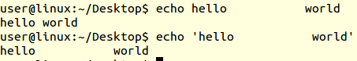

# 10일차

- 스택영역
  - 사용자가 책임져야! 각별한 주의가 필요
  - heap 영역을 침범할 수도, 스택 오버플로우
    - 에러가 생기지않기때문에 더 심각!!


## 최적화 
최적화 옵션 추가-fomit-frame-pointer

```c
    INCLUDE	= -nostdinc  -I. -I$(INCDIR) -I$(LIBGCCDIR)/include -I$(TOOLDIR)/$(TARGET)/include 

    CFLAGS	= 	$(INCLUDE) -g -Wall -Wstrict-prototypes -Wno-trigraphs -O0
    CFLAGS	+= 	-fno-strict-aliasing -fno-common -Wno-parentheses -Wno-unused-parameter -Wno-implicit-function-declaration
    CFLAGS	+= 	-Wno-unused-function -Wno-old-style-declaration -fomit-frame-pointer
    CFLAGS	+= 	-mcpu=arm9e -fno-builtin
```
- 최적화 옵션 추가 -fomit-frame-pointer
- 빼고 싶으면 -fnoomit-frame-pointer(?)
- 코드가 작아지면 속도가 느려지고,속도가 빠르면 코드가 커지고...둘다 좋은거는 없어!! 받아들여야...
* volatile를 너무 남발하지 말자!!
  * 이걸 쓰면 최적화가 안돼
  * 꼭 사용해야할 때만!!

  
  
  

```c
    /* macro 정의 */
        .macro HANDLER, HandlerLabel, HandleLabel
    HandlerDabort:
        sub		sp,sp,#4
        stmfd	sp!,{r0}
                                
        ldr		r0,=HandlerDabort 
        ldr		r0,[r0]         		
        str		r0,[sp,#4]      	
        ldmfd	sp!,{r0,pc}     	
        .endm

        Dabort_Handlerc
```

## 쉘 스크립트
- gcc : 컴파일러 
- shell 파일 : 컴파일을 이용해서 만든 파일
- bash파일 : 사용자가 러닝을 시켜줄수가 있어
- 운영체제 : 커널, bash, gcc가 있으면 된다.?
- 
- ps : bash가 알게모르게 사용되는걸 볼 수 있어
- man bash : bash 파일 보려고
- bash는 하나의 프로그램
- echo : c에서 printf와 같은?
- 단축키
    - ctrl + 방향키, 공백 기준으로 이동!!
    - ctrl + a : 맨 앞으로 커서를 이동(알파벳중 제일 앞이니까 ㅋㅋㅋ)
    - ctrl + e : 맨 뒤로 커서를 이동
- 리눅스 ctrl + z: 폴드 시켜줘(stop와 같은)
- 인용부호 필요한 이유
    - 
- kernal에서 로그데이터는 최신 파일은 맨뒤에 
    - cat으로 파일을 볼 수 있어
    - 
        - 근데 너무 길어!!
    - 최신꺼 10줄만 tail 사용
        - 
    - 처음꺼 10줄만 head 사용
        - 
- 별칭 : alias
    - 터미널이 새창이 켜질때마다 alias 가 저장이 안되고 update

- bashrc는 터미널이 새로 오픈될때마다 적용
    - 
        - 여기에 수정하고나서 새로 터미널이 생성하면 적용!!
        - 지금 터미널에서 적용하고 싶으면
            - source ~/.bashrc(source는 스크립트를 실행해주는 명령어)
- 리눅스 함수
```c
    subl() {}
    or 
    function subl () {]}
```
- 화면 지울 때 : ctrl + l
- $:저장된 변수를 읽어낼 때 사용

  
  
    
  
  
  
- 반복문
    - no=0; while [ $no -lt 10 ]; do ((no=no+1)); printf "%02d\n" $no;done
    -   
- PATH :
  - 
- tr : 소문자를 대문자로 변환
- 정규 표현식
  
  
  
  
  
  
  
  
  
  

- grep : 단어를 검색할 때
  - fgrep : 일반
  - egrep : 정수?
  - grep : fgrep와 egrep 합쳐
  - sed : replace with, 검색 후 교체
  - xargs 명령어 무엇? 알아두면 좋음!!