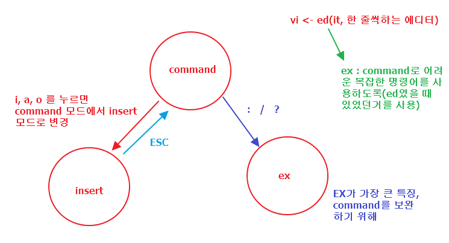
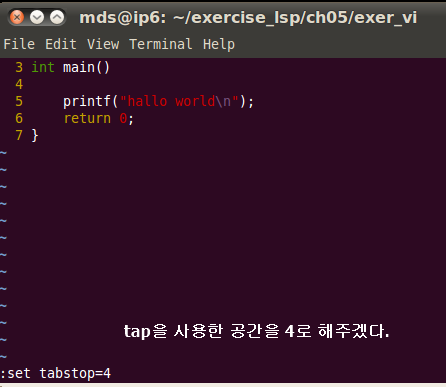
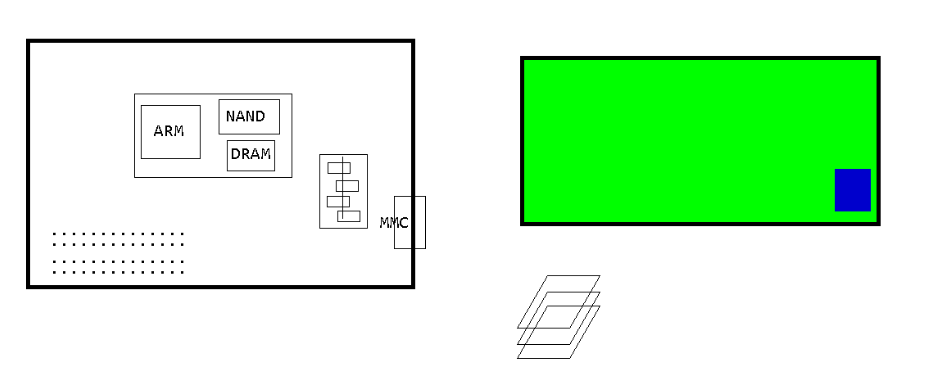
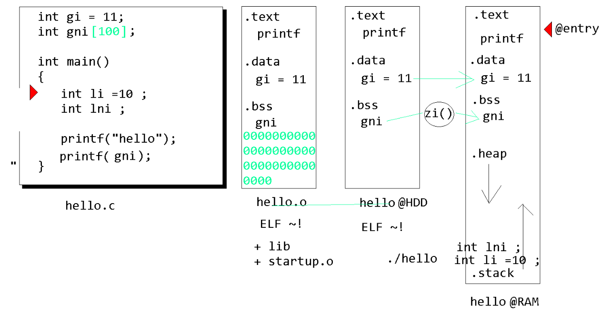
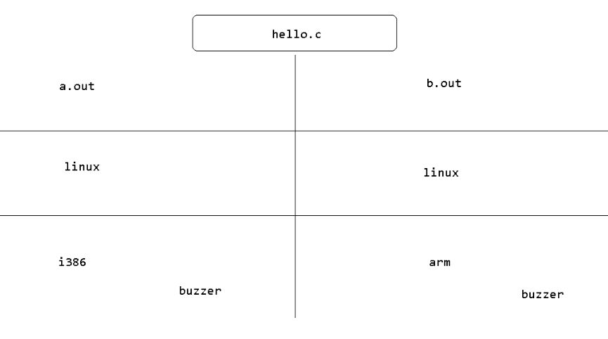

# 차량용 OS 시스템 프로그래밍
# 1일차 

## 개요
1. linux how to use
2. porting linux on board(porting)
   1. pc에서 돌려 봐
   2. board에 돌려보는 방법(우리는 이 방식을 해볼 것)
3. device driver programming(이 과정은 다음주로 변경, 이슈가 있어서..?)
4. application programming(이번주에 해야할 목표, 리눅스 위에서 짜는 것)


## virtual box
- ctrl + alt + t : 터미널 open 
- sudo -s : root 계정
  - pw : mdsmds
  
  
  
* pc
  * 이더넷 어댑터 로컬 영역 : 인터넷 네트워크
  * 이더넷 virtual box host-only network : 가상pc와 연결
* linux
  * ip 주소가 두개 있는것은 아래와 같이 설정을 했기때문 
    *   
    *   
    *   
  * 하나는 arm 보드에, 하나는 win에 연결(?)
  * 터미널 열고 아래와 같이 세팅을 해준다.
    *   
    *   
    *   

- pc에서 가상 머신 폴더와 연동된 곳
  - samba를 통해 연결한 듯
  - 위와 같이 세팅한 ip로 연결?
  - \\192.168.56.101\root
    -   
    -   
    -   
    -   
    -   
    -   

## vi editor
  
* .vimrc 파일을 수정하여 기본 환경을 세팅할 수 있다.  

### vi 문자열 치환
|명령어|설명|
|:--:|:--:|
|:%s/old/new/g|모든 줄의 모든 old를 new로 바꿈|
|:%s/old/new/|모든 줄의 old 중 첫 번째 것만을 new로 바꿈|
|:%s/old/new/gc|+ 치환할 것인지 사용자에게 물어봄|
|:s/old/new/g|현재 줄의 모든 old를 new로 바꿈|
|:2,4s/old/new/g|2행에서 4행 줄의 줄의 모든 old를 new로 바꿈|
  *   
  *   
* 그 외의 vi 에디터의 명령어는 책으로 보기

### vi 에디터에서 
- 저장 
  -   
  -   
- 종료
  -   
- tab 공간 지정
  -   

## tera term linux와 연동
* tera term에서 실행하면 Uboot가 들어가있어
  * arm 에 부트로더가 있음을 확인??
  *   
* 아래에 tera term에서 boot 하기위한 환경변수 작업을 한 후에 
*   

## tera term에서 boot 하기위한 환경변수 작업
```c
    ;
    ;	u-boot env setup scripts
    ;		by Seo Kwang Won
    ;

    ;
    ;  u-boot saves env into NAND offset:0x40000  size:0x20000 
    ;

    ;
    ;  history:   
    11:33 2017-06-27	fixed ramdisk error

    ;
    ;  ^c -> alt-v  each line to terraterm
    ;
    ;  don't copy multi-lines!
    ;


    set bootdelay 5

    set serverip  192.168.0.2	
    set gatewayip 192.168.0.1	
    set ipaddr    192.168.0.102	
    set netmask   255.255.255.0	

    ; echo firmware download address
    ; echo linux zImage down address
    ; echo this should be hex. otherwise INITRD mount would fail !
    set firmaddr 0x30000000	
    set zImgaddr 0x32000000	
    set ramdaddr 0x30800000 

    ; echo dongsoo board use UART1 as console
    set ramdsize 16M
    set terminal ttySAC1,115200n81	

    set bootcmd_firmw tftp $firmaddr aImage.bin ';' go $firmaddr
    set bootcmd_linux tftp $zImgaddr zImage  ';' bootm $zImgaddr
    set bootcmd_getzr tftp $zImgaddr zImage  ';' tftp $ramdaddr ramdisk.gz 
    set bootcmd_rdisk $bootcmd_getzr ';' bootm $zImgaddr
    set bootcmd_initr nand read $zImgaddr 00080000 00500000 ';' nand read $ramdaddr 00600000 01000000 ';' bootm $zImgaddr
    set bootcmd_yaffs nand read $zImgaddr 00080000 00400000 ';' bootm $zImgaddr

    set bootargs_nfs root=/dev/nfs rw nfsroot=$serverip:/nfsroot ip=$ipaddr:$serverip:$gatewayip:$netmask::eth0:off:netmask=$netmask console=$terminal
    set bootargs_ram initrd=$ramdaddr,$ramdsize root=/dev/ram rw console=$terminal
    set bootargs_mtd root=/dev/mtdblock2 rw rootfstype=yaffs2 console=$terminal


    ;
    ; ======================================================================
    ; booting scenario #1.  TFTP - NFS
    ;
    set bootcmd $bootcmd_linux
    set bootargs $bootargs_nfs
    save
```
* ;, echo 부분은 제외하고 tera term에 한 줄씩 복사!!
  * 윗 명령어를 복사해서 tera term에서 마우스 오른쪽 버튼을 클릭하면 복사 ok!! 


## 컴파일 과정
  1. hello.c 
  2. hello.i(전처리 과정) 
  3. hello.s 
  4. hello.o(더이상 볼수 없어, hexdump hello.o 로 봐야해, ELF relocatable, 재배치가능한 )
  5. cc hello.o(링크 하면) -> hello 라는 실행파일이 나오는(-> ELF executable, 실행가능한 파일)

- 리눅스 명령어 : size ~.c
  - text : rodata(상수), instruction
  - data : 초기화한 전역 변수, 초기화한 static 지역 변수
  - bss : 초기화하지 않은 전역 변수, 초기화하지 않은 static 지역 변수
  - 나머지 지역 변수는 .o파일에 없엉
- rom에서 ram에 올려진 후에 heap와 stack가 생긴다!! (지역변수는 stack에 잡혀있다. )
- core에서 rom에 올려진후 실행하게되면 ram에 올려가면서 data는 그대로 올라가고 bss는 제로로 초기화해주고 heap, stack가 생성

## 그림 추가 설명 (불확실행....)
1. rom,ram 구조
  *  
  * rom이 0번지로 지정되어있어 
  * arm은 0번지로 시작된다. 
    * arm이 실행되면 0번지인 rom에서 실행되고 그 속에 data, bss가 ram 에 복사된다. 
    * 만약에 rom이 잘못됬을 경우 rom을 다 뜯어내야된다. 
      * 그래서 등장!! 플래시(flash)!!
2. nor flash, ram 구조
  * 플래시는 중간만 수정하면된다!!
  * nor flash 제외하고는 다 samsung에서 잘만든다!!
  * .mp3와 같은 거를 추가하려니 플래쉬 용량이 작다
    * 그래서 ram을 확장하고 intel에서 만든 nor 플래시를 없애고 nand controller를 붙여서 nand flash를 사용한다.
3. nand flash, ram 구조
  * 
  * rom과 ram은 같은 버스이다. 그래서 바로 붙일수가 있어!!
   * nand flash 같은 경우는 다른 새로운 메모리의 버스를 연결 시켜주려면 동일하게 해줘야해 
     * 기존의 버스와 새로운 메모리와의 버스를 연결해주는 작업을 해야한다.
       * 이거를 nand controller라고 한다!!
   * 하지만 주소를 명시해주는 어드레스 버스가 없어서 패치할 수가 없다.
   * 실행코드를 집어넣어도 실행할수가없어
   * 그래서 irom과 iram(sram)을 추가해서 irom에 기본적인 부트로더를 추가 해놓는다.   
   * irom을 0번지로 지정해놓으면 arm은 0번지부터 실행하므로 0번지인 irom에 있는 부트로더를 통해서 실행하고 nand controller를 통해 nand flash 메모리에 가서  윗부분(헤더부분) 일부분만 복사해서 iram에 복사를 해준다.   
   * 실행포인트를 iram에서 가져온 윗부분을 가리켜!!
   * 그러면 iram이 초기화되면서 죽어있던 확장된 ram(dram)이 살아난다.  
   * 그리고 나서 text, data, bss를 전부 카피해서 ram으로 복사!!
   * 그리고 실행포인트를 복사해놓은 ram을 가리킨다.  
   (dram은 초기화를 제대로 안해주면 사용 못한다. )
   * iram은 sram, sram은 초기화 안해줘도 사용이 가능해!!, 단 용량을 크게 할수없어
   ram은 dram으로 용량은 큰데 초기화를 안해주면 사용할 수가 없어 
4. h/w 구조(메모리가 쌓인?)
   * 
5. s/w 구조
   * 
     1. 실행이 안되는 elf에 + lib, startup.o를 추가(링커?)
     2. 실행가능한 elf 파일 생성
     3. bss는 zero로 초기화해서 ram에 올려주면서 ram에 stack가 생성되고 그 스택에 지역변수가 올라간다. (변수가 올라가는 위치를 주의)
     4. 초기화된 ram은 사용할 수 있다. entry 포인트가 올라간다.  
### 아래와 같이 3개가 있으면
    UBOOT
    zImage : 리눅스 커널
    rootfs : 하드디스크
    => 리눅스가 돌아!!

## 리눅스에서 작업
- 리눅스와 윈도우 공유폴더 위치
  -    
- 컴파일러  
  -   
  - cc를 이용해서 컴파일 해보면 a.out 생성
    -   
    -   
      - 리눅스상에서는 정상적으로 실행된다.
    -   
      - arm 보드에서는 실행이 안된다!!
  - 왜? : 실행하는 컴파일러 환경이 달라(?)
    -   
      - a.out의 정체를 확인해보닌 intel 용
      - uname -a : 지정된 시스템 정보를 모추 출력
        - i886 의 컴파일러
    -   
      - arm 보드에서는 arm5버전.... 언어가 다르다고 봐야한다!! 그래서 에러가 난 것
      - 
  - 크로스 컴파일러를 사용해야한다.!!
    - 크로스 컴파일러 압축 풀기  
    -   
    -   
    -   
  - 압축 해제된 컴파일러 사용
    -   
    -   
      - 크로스 컴파일러 사용
  - 크로스 컴파일후 기존 컴파일된 파일과 비교
    -   
  - 정상작동 확인
    -   
    -   


