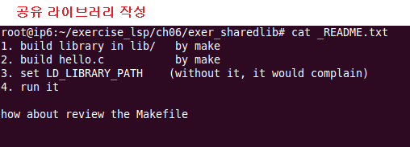
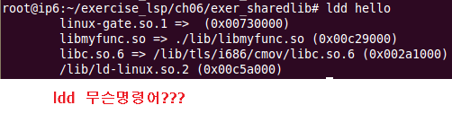
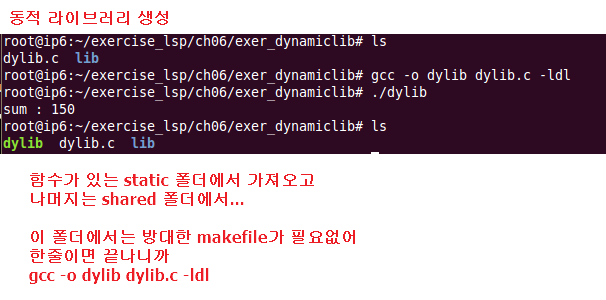

# 2일차

## c표준 라이브러리
* 리눅스는 c 기반
* POSIX : 함수이름을 통일했다. 
* ISO : libc(관용적으로 lib를 앞에 붙여)
* GNU/Linux : GNU 오픈소스해야 쓸수있는것, glibc(gnu의 g)
* 라이브러리 : 함수, 자료형, 상수
* pringf를 구현한 함수를 보면 
  * va_start, va_arg, va_end가 있어 
  * 여러개의 파라미터가 올수 있도록 해준다. 
## make 
* 프로그램 빌드 도구
* 파일들간의 의존성 검사, 각 소스 파일의 인식을 통해 프로그램 빌드하는 기능 
   
   
   
* make file 작성법
  * ```c
    target : dependencies
        command
        ```
  * target : dependencise(source)를 가지고 command 부분이 실행되어 나온 결과파일
    * 오브젝트 파일, 실행 파일
  * dependencies(source) : target을 만들기 위한 입력으로 사용되는 파일(주로 .o)
  * 모든 command 라인에는 반드시 탭하나가 들어가야해!!!(여러줄 사용가능)

## 컴파일 명령어
* a.c -> a.i -> a.s -> a.o -> a.out
  * cc -c a.c
    * 링크는 하지말고 object 파일만 만들어라. a.o
  * cc a.c
    * 옵션을 주지않으면 링커까지!! a.out 파일 생성
  * gcc -o baz foo.o bar.o
    * foo.o와 bar.o를 링크하겠다.
    * 실행파일 이름은 baz
## make file
1. 컴파일 과정
   1.    
2. 11페이지
   1.    
   2.    
   3.    
3. 나머지 make file
   1.   
      1. 내부 매크로
         1. $@ : target 파일
         2. $< : source(dependencies) 파일 중 최근에 갱신된 파일 
      2. 만약 make file에서 링크 디렉토리를 따로 지정해주고 싶다면
         1. INC = -I/디렉토리 경로 
   2.    
   3.    
   4.   

## 라이브러리 생성방법 
### 정적 라이브러리
* 아카이브라고 불린다.
* object file의 묶음(.o)
* 메모리 낭비
*    
  * ar rc libmylib.a mylib.o
    * ar은 아카이브를 뜻해
    * mylib.o를 libmylib.a에 모두 꽂아버려
  * a.o -> a.out : 링크 단계에서만 라이브러리가 필요
  * 만약 undefinded reference ~ 에러가 나면 링크단계에서 에러
* gcc -c mylib.c
* ar rc libmylib.a mylib.o
  * 라이브러리 파일은 lib라는 이름을 앞에 관용적으로 붙여준다.
  * .o파일을 전부 다 .a라는 아카이브 파일에 다 꽂아넣어!!
* gcc -o main main.c -L./ -lmylib
  * -L : 라이브러리를 찾아주는 디렉토리를 지정(위치)
  * -lmylib : libmylib.a를 찾아준다.앞에 l은 lib를 의미한다. 그 뒤는 이름!
### 링크 명령어
*    
*    
  * ls -i : 파일의 고유 아이디를 알수있다. 
*    
  * ln
    * 이름표를 만들어
    * hard link라 불린다.
    * window에서는 없는 개념
*    
  * ln -s
    * 색도 다르고 고유의 아이디가 다르다!
    * 다른 파일이라는 의미
    * symbolic link라 불린다.
    * window에서 바로가기 개념
    * ln -s라는 옵션을 넣어주면 그 생성된 파일 속에 파일을 가리키는 내용물만 들어가있다!! 실질적 내용이 없어!!
  *    
    * 그래서 결국 같은 파일이므로 하나를 수정하면 동시에 수정된다!!
### 공유 라이브러리
* 프로그램이 시작될 때 적재
* 가장 많이 사용
* 먼저 컴파일한 a.out에 필요한 라이브러리로 올라가고나서 b.out에도 공통적으로 필요한 라이브러리가 올라갔으면 같이 공유해서 사용, 즉, a.out에 올라간 라이브러리외에는 없으면 b.out만 올라간다는 의미 
* 정적라이브러리 사용하면 메모리 낭비가 심하므로 공유 라이브러리를 주로 사용한다. 
* 사이즈는 작아지지만 적재 시간이 더 걸릴 수 있어 
* 공유 라이브러리 작성 순서
  *    
*    
  * gcc -shared -Wl, -soname,libmylib.so.1 -o libmylib.so.1.0.1 mylib
    * -soname : libmylib.so.1까지 이름으로 하겠다.
    * -o : output 이름 형태를 libmylib.so.1.0.1 로 하겠다.
    * mylib.o라는 내용물을 libmylib.so.1.0.1 에 다 넣어 놓겠다.
    * so는 shared object, 공유된 파일을 전부 so 확장자를 가진다. 
  * ln -s /경로/libmylib.so.1.0.1 /경로/libmylib.so
    * 바로가기와 같은 링크파일을 만들어서 libmylib.so을 생성
    * 실질적으로 libmylib.so를 엑세스한다.
* lib 폴더 make
  *    
  *    
    * so 파일 생성
* main 함수 make
  *    
  *    
    * hello.o 생성
* 백그라운드에 돌게하는 명령어
  *    
  *    
  *    
    * ps로 백그라운드에 돌아가는 프로세서 확인
* pmap 확인
  *    
  *    
* ldd 명령어
  * ldd(List Dynamic Dependencies)는 프로그램이나 공유 라이브러리들이 요구하는 공유 라이브러리(shared libraries)를 출력하는 명령 행(Command Line)프로그램이다. 
  *    
### 동적 라이브러리 
* 끌어 올렸다가 필요없어지면 내리고...?
* 속도에 문제가 생길수도
* 가볍게 돌리는건 가능하지만 큰거는 버벅거릴 수도 있다. 
* 동적라이브러리 폴더 생성
  * mkdir 
* dylib.c, Makefile파일과 lib 폴더 생성
  *    
  * 동적 라이브러리 실습하기위한 dylib.c 파일 생성
    *    
* 두개의 파일을 생성해주고 컴파일
  * gcc -o dylib dylib.c ldl
    *    
  * makefile 만들 필요가 없다!!
    * 위의 명령어 한줄에 끝나니까!! 낭비
  *    
* lib 폴더
  * 여기에서는 makefile 생성해주어야해
    *    
  * so파일을 만들기위한 makefile
    *    
  * sum 함수가 들어간 라이브러리 파일
    *    
    *    
* 제대로 동작을 하면
  *    


