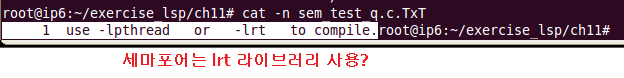

# 5일차
## pthread_exit() 보충
* 프로세스에서 return()과 exit()는 같다.
* 스레드에서 return()과 pthread_exit()는 같다.
  * 스레드에서 exit()는 프로세스도 종료한다는 뜻?
* 프로세스에서 pthread_exit() 호출하면 리더 스레드만 종료
* 프로세스에서 return, exit()하면 모든 스레드가 다 소멸된다. 
* process(sytstem) resources : 파일
* thread specific resources : 
* 스레드 안에 가지고 있는 자원 FDT, .stack들을 pthread_exit(), 스레드 안에서 return()하면 리더 스레드에서 있는 pthread_join()이 해제를 해준다. 
* join을 안하고 pthread_exit()하면 프로세스 종료되기 전까지 해제되지 않아
* 지금까지 얘기는 전부 atached 상태!!
* 만약 detached 상태는 스레드 스스로가 종료할때 내부적으로 스스로 해제를 한다. 
* pthread_cancel(thread id)
  * cancel disabled : 아무리 pthread_cancel()를 요청해도 죽지않아.
  * enabled async : 위험한 방식, 죽으라하면 바로 죽어, 만약 메모리가 할당되고 자원이 해제 되지않은 상태에서 pthread 종료 시켜버리면 안돼!
    * cancleation point지점이 없다. 
    * cleanup 함수가 도착되기도 전에 죽어버리면 끝!! 위험해   
  * enable deffered : 죽어라고 하면 시그널 형태로 날라가, signal(=cancel request), 여기선 죽을수 없다. 좀더 안전한 종료할수있는 포인트가 있다. 아무데서나 죽지 x 
    * cancleation point지점이 있다. 
    * cancleation point조건이 만족되어야 종료. 
    * 이 포인트가 안전한 함수에 위치되어야..?

* cleanup stack : 이 내부에 자원들을 해제하게 만드는걸 넣어줘 , 종료할 때 뭘해야할지 일들을 쌓아놔 
  * pthread_cleanup_push(freefunc())
  * pthread_cleanup_pop(n) // n=0, x0=exec
  * 만약에 freefunc() 함수가 실행되기 전에 종료가 되면 cleanup stack에 쌓여있는 freefunc()등등을 pthread_cleanup_pop(1)로 부른다.
    * 1은 빼서 실행을 해라라는 뜻 

## 동기화
* 두 개 이상의 프로세스가 동일한 자원에 접근할 때 잘못된 연산을 없애고 일관성을 보장해야한다.
* 차례차례 하도록
* 동기화
  * 세마포어 : 네덜란드말, 철도 건널목 신호등(철도지나가고 사람지나가고)
  * 뮤텍스 : 세마포어 확장?
  * 조건 변수

  

## IPC 
* 프로세스간 통신 정의
* 기본적인 통신 기법 : 파이프와 FIFO 
* 프로세스 간에 메모리는 독립되어 있어서 서로의 자료를 전달할 필요가 있다. 
* 공유된 커널 메모리를 이용하여 프로세스간 통신 해결

### PIPE
* 단방향 통신 채널
* 이름이 없는 PIPE
  * 같은 주소 공간에서 통신할 때 사용
* 이름 있는 PIPE(FIFO)
  * 이름없는 파이프는 fork()로 만들어진 프로세스들 사이의 통신에만 사용 가능한 제약이 있음
  * 제한을 극복하기 위해 파이프에 이름을 지정하고 임의의 다른 프로세스에서 파이프에 접근하도록 한 것을 named pipe(FIFO)라 함

## 메시지 큐
* 버퍼 형태의 오브젝트 
* 