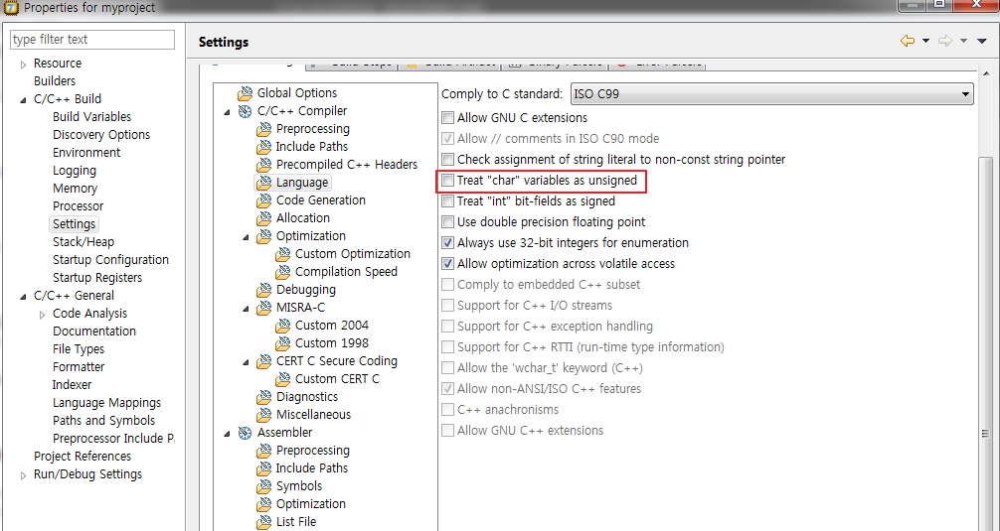
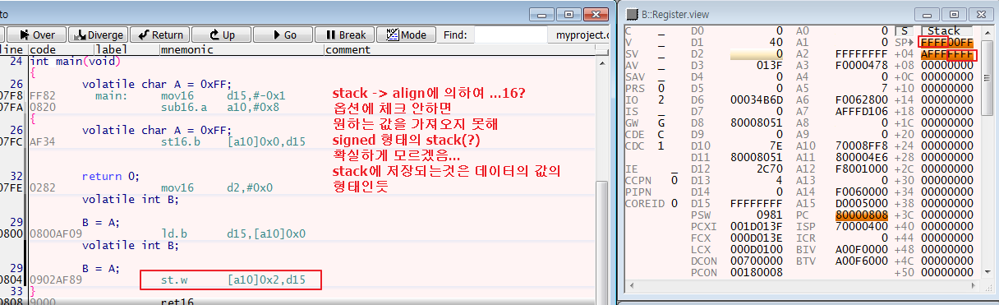
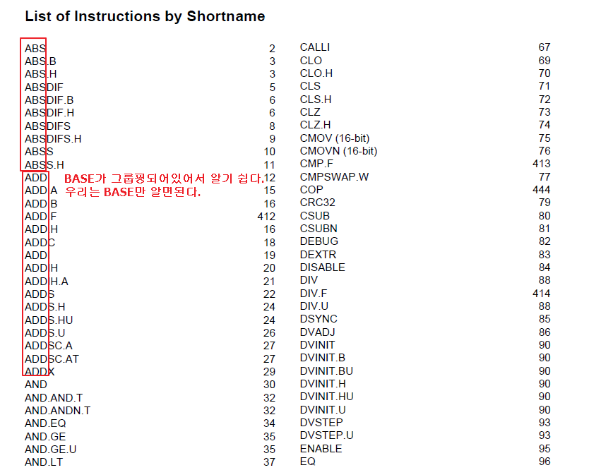

# 4일차 실습
## align trap 발생 실습
  *      
  *      
  *      
  *      
  *      
  *   
* array
  * 똑같은 타입을 사용하기 때문에 패딩이 안생겨
  * 빈 공간이 안생겨(align관련 문제가 안생길듯?)
* 구조체
  * 여러가지 타입의 집합

## 연산자의 우선순위
* 위치를 파악
* *id[10];
  1. []가 우선
  2. 그 다음이 * 연산
* int **arr[2][3];
  1. [*][]
  2. [][*]
  3. *arr[][]
  4. **arr[][]
* void (*id[10])(void);
  1. [10] 
     * 모든 데이터 타입이 처음 우선순위로 기준을 잡는다. 
  2. (*)
  3. (void)
  4. void 
   * 즉, 이것은 배열 구조로 만든다.  
   * 그리고 그 내부는 다음 우선순위인 *인 주소타입이 들어간다. 
   * 근데 무슨 주소? 불안정 그다음 우선순위에 보완된 정보가 있어 
     * (void)는 함수,즉 함수 주소가 들어간다. 함수는 그자체로 불안정
   * 맨 앞에 void, 리턴값이 void 형태이다. 완전한 형태 완료!
     * void는 아무것도 안받는다. 리턴값이 없다. 
* void id[10](void) 
  * error!! why??
    * void id[10]와 함수의 배열은 안된다!!
      * 배열 속에 어떠한 값이 안들어가!! 허용해주지 않아 
      * 크기에 대한 정보가 없어서 인코딩할 수가 없어
    * 최적화를 통해 함수의 크기는 변해 
      * 즉, 함수의 크기는 가변한다. 
      * 함수는 크기가 정해져 있지 않기 때문에 배열로 담을 수 없다. 
* 위의 추가 학습
  * 포인터 배열
    * 포인터들의 [배열]
    * 배열 요소가 포인터로 이루어져 있다. 
    * char *arr[10]
      * 우선순위가 []
  * 배열 포인터
    * 배열을 가리키는 [포인터]
    * char (*arr)[10]
      * 우선순위가 (*arr)
## 배열 실습
    ```c
    int main(void)
    {
        volatile char A[10] = "string";
        volatile char *B = "string";
        // 차이점 : 사이즈, 
        // A[10]은 원본 수정하지 x, 복사해서 사용하는 것 
        // *B는 원본을 수정할 수 있어
        
        A[1] = 'a';
        B[1] = 'a';
        
        *(A+1) = 'a';
        *(B+1) = 'a';
        
        return 0;
    }
    ```
* 위의 코드에서 trap 빠진 상태
  *      
  *      
## Little endian Vs Big Endian
     

# 우선순위
* short*(*(*var)())[5]
    * 배열에는 함수와 void를 담을 수 없다. 
    * return 은 short *(*)[]

## char 형태의 불안정
*    
*    
*    
*    
*    
*    
* 레지스터는 signed라고 생각한다. 
* 포인터 타입은 더하기 빼기는 되지만 나머지는 안된다. 

## 데이터 타입 변환
1. char
2. short
3. signed int
4. unsigned int
5. float
6. double
7. long double
* 큰 쪽으로 형변환
  * int보다 작은 char와 short는 다르다!!

```c
	volatile unsigned int A = -1;
	volatile signed int B = 1;
	volatile int tmp = 0;
	// if(0xffffffff > 0x00000001)
	// unsigned와 signed는 인코딩이 달라!!
	// 다른 타입이 되어야하는데 위에 true로 하려면
	// signed가 unsigned가 되어야 1이 된다.
	// int보다 작은거는 int로 변환
	// char + short -> 각 각 int로 변환되서 연산!! 
	// int + float -> int가 float로 변환되서 연산(컴퓨터마다 달라)
	// float + double -> float가 double로 변환 
	
	if(A>B)
	{
		tmp = 1;
	}
	else
	{
		tmp = 2;
	}
```
*    
*    
*  


## 데이터 타입
* 데이터 타입은 양쪽에 다 있다(왼쪽에만 잇지 x)
* int arr[2][3]
  * arr : int [2][3]
  * &arr[0] : int (*)[3]
    * 형변환이 일어난 것 
    * 즉 int (*A)[3]으로 만들어야...?
  * arr[0] : int [3]
* int A;
  * A : int
  * &A : int (*)
    * ()는 우선순위를 뜻한다.
* 이런 문법을 거의 본적 없는 이유
  * 가려진다.
  * ```c
    typedef int (*ID)[3];
        // typedef를 사용하면 ID var 이런식으로 사용할 수 있어.
    typedef int ARR[2][3];
        // ARR var1

    ```

## pointers
* 이 타입을 받을 수 있는 포인터 타입
```c
    int A[5];       // int (*p);
    int A[2][3];    // int (*p)[3];
    int *A[5];      // int *(*p);, int **p;
    void (*A[256])(void);    // void (*(*p))(void) = A;
    // A[] -> (*p) 로만 변환하면 ok
```

## 구조체의 주소를 매개변수로 넘겨줄 때
```c
/*****************************************************
 *
 * myproject.c
 *
 * Description : Hello World in C, ANSI-style
 *
 */

void func(int *arg)
{
/*
    // a -> 'A'
    volatile char a = (*(struct va_tag *)arg).a;
    // b -> 10
    volatile short b = (*(struct va_tag *)arg).b;
    // c -> 500
    volatile int c = (*(struct va_tag *)arg).c;
    // d -> 1000
    volatile long d = (*(struct va_tag *)arg).d;
    // e -> 3.14
    volatile float e = (*(struct va_tag *)arg).e;
    // f -> 6.625
    volatile double f = (*(struct va_tag *)arg).f;
    // *P -> 123
    volatile int * p = (*(struct va_tag *)arg).p;
    volatile int tmp = *p;

    p = ((struct va_tag *)arg)->p;
*/
    // a -> 'A'
    volatile char a = *((char *)arg+0);
    // b -> 10
    volatile short b = *(short *)((char*)arg+2);
    // c -> 500
    volatile int c = *(int *)((char*)arg+4);
    // d -> 1000
    volatile long d = *(long *)((char*)arg+8);
    // e -> 3.14
    volatile float e = *(float *)((char*)arg+12);
    // f -> 6.625
    volatile double f = *(double *)((char*)arg+16);
    // *P -> 123
    volatile int * p = *(int **)((char*)arg+20);

    // (*). ==
    // p = (*).;
    // (struct va_tag *)arg->p;
    // arg : 피연산자
    // -> 연산 순위가 제일 높아
    // int * -> 는 할 수 없어
    // arg를 구조체라고 형변환을 시켜주고
    // p = ((struct va_tag *)arg)->p;
    // p = (*(struct va_tag *)arg).p;
}
typedef short * SSI;
typedef SSI (*AP)[3];
typedef AP (*FP)(void);

// 4
short *(*(*var)(void))[3];
// 3
SSI (*(*var)(void))[3];
// 2
//AP (*FP)(void);를 FP를 아래의 내용으로 치환
AP (*var)(void);
// 1
FP var;

struct va_tag
{
    char a;
    short b;
    int c;
    long d;

    float e;
    double f;
    int *p;
};

int main(void)
{
    int start = 123;

    struct va_tag var = {'A', 10, 500, 1000, 3.14f, 6.625, &start};

    func(&var);
}

```

|'A'|x|b|b|
|:--:|:--:|:--:|:--:|
|c|c|c|c|
|d|d|d|d|
|e|e|e|e|
|f|f|f|f|
|p|p|p|p|
* align 은 주소가 짝수로만 저장된다. 
* align으로 맞춰주기 위해서 char는 8bit, short 16bit 
* 127페이지 참고 
*    
*    


## main으로 돌아가는 방법
1.    
2.    

## assembly
* tricore에서는
  * BASE OP1.OP2
  * BASE : 기본 연산자(더하기, 로드, 스토어, AND, OR 등등)
  * 예시 : ADDS.B 
    * 우리는 BASE 연산인 ADD만 알면되, 그뒤에 옵션은 표에 나와있다. 
*    
*    
* ADD는 피연산자가 3개가 필요
  * 저장하지 않으면 효과가 없음! 한 사이클 버리는 거임
  * ADD D0, D1, D2
    * D0 위치가 저장하는 위치 -> D
    * D1,D2 -> S1,S2
    * D0 = D1+D2
    * 대부분 연산에 피연산자가 3개이므로 이런 패턴으로 진행된다.  
  * ADD D0,D1
    * 이런 경우는?
      * D0 <- D/S1(복합적)
      * D1 <- S2
  * MOV D0, D1
    * D0 -> D
    * D1 -> S

## 메모리 접근
* 한정된 메모리에 절대주소를 담을수 없기 때문에 이런방식은 사용하지 않아
* 레지스터에 base 주소를 저장하고 
  * 그 base 주소에 offset를 더해서 접근하는 방법을 사용해야 
* ST.W [A10]0x9, D1
  * A10의 주소에 0x9(offset)를 더해서 접근
  * 즉, 주소를 가공해서 절대 주소처럼 접근하는 방식     

## 시스템 명령어
* system call : 접근 권한
* sysnchronization primitives(DYSNC and ISYNC)
  * 시스템적으로 캐시를 밀어버리거나 파이프라인을 비워버리게 하는것
* CSFRs
* RET,RFE : return 관련
* trap 
* nop : 한 클럭을 연산없이 보내는 것


1.    
2.    
3.    
4.    
5. 빌드만 하고 
6.    
   1. mc를 클릭
   2. sys.up 명령어 
* 코드 보는 방법
  *  하나하나 step 하면서 모르면 매뉴얼 읽기
  *     
  *     
  *     
     *  mfcr, mtcr
        *  m : move, f : from, core : core, r : register
           *  LD
        *  m : move, t : to, core : core, r : register
           *  ST
        *     

