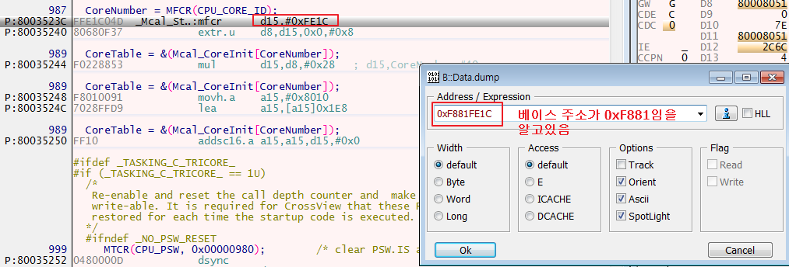
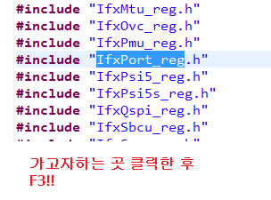
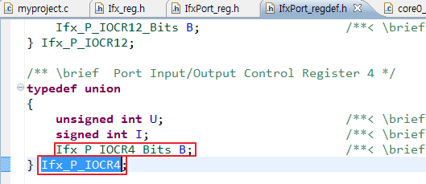

# 차량용 sw 개발 마지막날!
## MFCR, MTCR
* 레지스터로 옮겨오는 작업
* read
* mfcr d15, #0xfe2c
  * 명령어에 퍼미션이 걸려서 보호
  * 베이스 주소가 보이지 않아서 보호
    * 오프셋 주소로만 알수없음
  * mfcr 명령어는 중요하니까 보호가 되야해 

## EXTR.U
* Extract Bit Field Unsigned
* EXTR.UD[c], D[a], pos, width
  * D[c] = sign_ext((D[a] >> pos)[width-1:0]);
* pos : position
* 1000번지에 있는데이터 중에 10비트부터 4자리를 꺼내서 가져오세요
  * pos : 10번비트
  * width : 4자리
  * d : 읽어올 데이터
* D[a], pos, width : 비트를 추출하는 파라메터들

## lea
* load effective address
* 더해서 주소를 만드는 것
* 접근할 주소를 가공하는 것 
* LEAA[a], A[b], off10
  * EA = A[b] + sign_ext(off10);

## addsc.a
* Add Scaled Index to Address
* 큰수를 올리는 것...? 2^3까지 올릴수있는?
* ADDSC.AA[c], A[b], D[a], n
  * A[c] = A[b] + (D[a] << n);
* addsc16.a a15,a15,d15,#0x0
    1. d15를 #0x0만큼 비트를 shift한다.
    2. 1번 값을 a15를 더해
    3. 2번 값을 a15에 저장

## dsync
* 이 명령어를 수행한 시점에서 부터 
* 그전에 일어난 명령어들이 다 진행이 안됬을 수도 있어
* 그 뒤에 단계에 연산을 하는데 영향을 줄 수 있다.
* 그전에 연산된 값을 참조해서 그 뒤에 명령어를 실행해야한다 하면 문제가 생겨
* 특정한 명령어를 수행하기 전, 이후에 이전에 값을 완료했다는 것을 보장해야해
* 그래서 dsync가 필요한것
* 원래는 nop를 사용할수도 있어(몇 사이클이 지나면 완료되게끔)
* 위의 단계들을 명령어로 만든것? dsync는 데이터를 밀어버려
* 파이프라인의 모든 명령어를 다 실행해버리는 것


## INSERT
* 내가 원하는 곳에 값을 채워 넣는것

## RET
* Return from a function that was invoked with a CALL instruction. The return address is in register A[11] (return
address). The caller’s upper context register values are restored as part of the return operation.

## SH

## ld.w
* ld16.w d0,[a15]0x0
  1. [a15]+0x0 연산한 값은 주소
  2. 1.에서 연산한 주소안에 있는 데이터값을 d0로 로드
  3. w는 word 단위..? 4바이트 단위로...

## I/O 다루는 방법
* I/O에 접근할 때 
  * ```c
        int *p = 0xF0000000;
        *p = 10;
    ```
    * 공간 낭비
    * I/0 주소하나에 접근하기 위해서 포인터 변수하나를 더 만들어 줘야해서  
  * ```c
        *(int *)0xF0000000 = 10;
    ```
    * 209페이지참고
    * (int *) 주소라고 형변환은 시켜준다.
    * 맨 앞에 *은 그 주소의 값을 접근할 수 있도록 해준다. 
    * (int *) -> struct, unsigned, signed를 주로 사용
      * 보통 volatile를 사용한다.
        * 최적화를 할 경우 주소를 상수화하거나 사용하지 않을 경우는 주소를 없앨수도 있다. 

## 실습
> 디버거 스텝 진행 - f2  
> 반복문 파악 - ex) jne, 이부분에서 break  
> 이 예제는 d0를 보면 0으로 감소되면서 값들을 초기화 진행해주는 것  
* ja
  *    
    * ja, asm();
* mfcr
  *    
    * offset, 베이스 주소는 이미 알고 있음
    * 베이스주소가 안보이기 때문에 보호된다. 
  *    
  *    
  *    
* extr
  *    
  *    
  *    
* mul
  *    
    * mul 실행 결과
* lea
  *    
    * lea 전
  *    
    * lea 후
* 코드 명령어, addsc
  *    
  *    
  *    
* mov
  *    
* mtcr
  *    
  *    
* 레지스터에서 ?의 의미
  *    
* trap 에서 디버거에서 확인해야 할 것
  *    
* ja
  *    
  *    
* mtcr
  *    
  *    
* insert
  *    
* jne
  * 반복하는 부분을 파악하자!
  *    
  *    
* call
  *    
  *    
* ret
  *    
  *    
* 디버거...확인?
  *    
  *    
  *    
  *    
* led 실습
  *    
  *    
  *    
  *    
  *    
  *    
  *    
    * union을 사용하면 효율이 높다. but 연산량이 많아져 속도가 느려진다.
    * U,I,B로 접근이 가능, store 명령 하나만드로 가능
  *    
  *    
  *    
  *    
  *    
  *    
  *    
  *    


