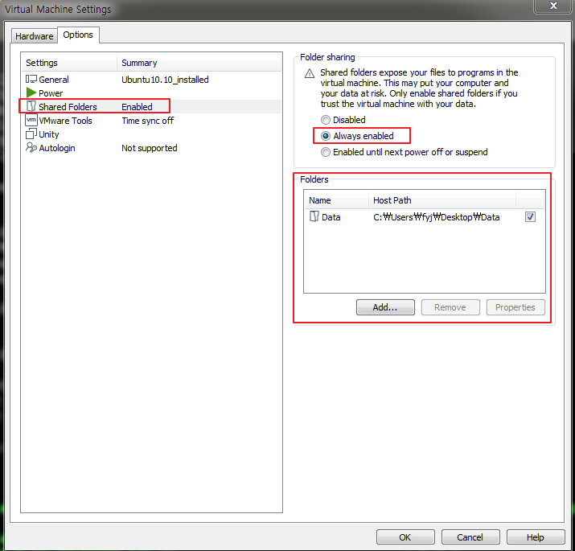
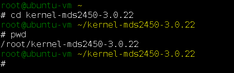
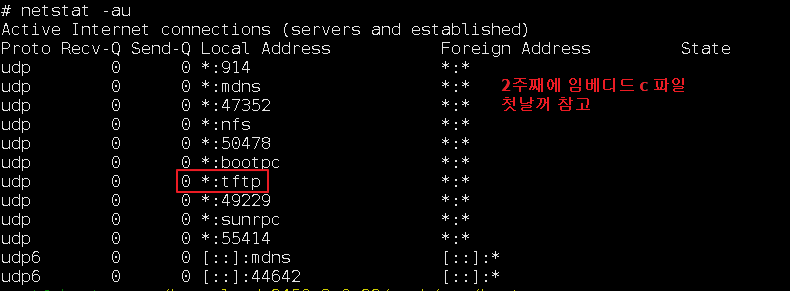
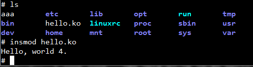

# 디바이스 드라이버 1일차
## 디바이스 드라이버
- 커널
  - 커널은 os이다.
  - os는 operating system 
# 리눅스 환경 세팅
## 순서대로 진행
  
  
    - 공유 폴더 경로 : /mnt/hgfs/Data
  
  
  
  
  
  
  
  
  
  
  
  
  
  
  
  
  
  
  
  
  
  
  
  
  
  
  
  
  
  
  
  
  
  
  
  
  
  
  
  
  
  
  
  
  

