# 2일차

## open.c(커널 - open, release)
* 맨 마지막 부분을 먼저 보자? 
  * module_init(sk_init); //init는 insmod할 때 호출된다. 
  * module_exit(sk_exit); 
```c
/***************************************

 * Filename: sk.c

 * Title: Skeleton Device

 * Desc: Implementation of system call

 ***************************************/

#include <linux/module.h>

#include <linux/init.h>

#include <linux/major.h>

#include <linux/fs.h>

#include <linux/cdev.h>


MODULE_LICENSE("GPL");


static int sk_major = 0, sk_minor = 0;

static int result;

static dev_t sk_dev;


static struct cdev sk_cdev;


static int sk_register_cdev(void);


/* TODO: Define Prototype of functions */

static int sk_open(struct inode *inode, struct file *filp);

static int sk_release(struct inode *inode, struct file *filp);


/* TODO: Implementation of functions */
// int (*open)(struct indoe * , struct fild *)과 같은 형태 
static int sk_open(struct inode *inode, struct file *filp) // 유저가 짠 것

{

    printk("Device has been opened...\n");

    

    /* H/W Initalization */

    

    //MOD_INC_USE_COUNT;  /* for kernel 2.4 */

    

    return 0;

}


static int sk_release(struct inode *inode, struct file *filp)

{

    printk("Device has been closed...\n");

    

    return 0;

}


// 제일 중요한 포인트!!!
// sk_fops 부분이 tag명 
struct file_operations sk_fops = { 

    .open       = sk_open,
    // .open은 함수 포인터..? sk_open을 연결
    // int (*open)(struct indoe * , )
    .release    = sk_release,

};


static int __init sk_init(void)

{

    printk("SK Module is up... \n");


    // sk_register_cdev는 유저 함수
	if((result = sk_register_cdev()) < 0)

	{

		return result;

	}


    return 0;

}


static void __exit sk_exit(void)

{

    printk("The module is down...\n");

	cdev_del(&sk_cdev);

	unregister_chrdev_region(sk_dev, 1);

}


static int sk_register_cdev(void)

{

	int error;


	/* allocation device number */

	if(sk_major) {
        // 번호를 임의로 지정해서 할당하고 싶을 때
		sk_dev = MKDEV(sk_major, sk_minor);

		error = register_chrdev_region(sk_dev, 1, "sk");

	} else {

		error = alloc_chrdev_region(&sk_dev, sk_minor, 1, "sk");
        // alloc_chrdev_region은 커널에 있는 함수 
		sk_major = MAJOR(sk_dev);
        // MAJOR 펌웨어서 자동으로 할당해줄 수 있는 번호
	}


	if(error < 0) {

		printk(KERN_WARNING "sk: can't get major %d\n", sk_major);

		return result;

	}

	printk("major number=%d\n", sk_major);


	/* register chrdev */

	cdev_init(&sk_cdev, &sk_fops);
    // cdev_init : 시스템 함수, character device
    // sk_fops : 

	sk_cdev.owner = THIS_MODULE;    // this는 자기 자신, this..현재 시간?

	sk_cdev.ops = &sk_fops; // 함수가 등록된것은 sk_cdev.ops에 연결

	error = cdev_add(&sk_cdev, sk_dev, 1);  // 커널에 등록, device를 한개 등록


	if(error)

		printk(KERN_NOTICE "sk Register Error %d\n", error);


	return 0;

}


module_init(sk_init); //init는 insmod할 때 호출된다. 

module_exit(sk_exit); 

```

## open_app.c(application - open, release)
- main이 들어가있어, 응용계층? 
- 커널단에도 main 함수 넣을 수 있어
```c
/***************************************

 * Filename: sk_app.c

 * Title: Skeleton Device Application

 * Desc: Implementation of system call

 ***************************************/

#include <stdio.h>

#include <unistd.h>

#include <stdlib.h>

#include <fcntl.h>


int main(void)

{

    int fd;

    

    fd = open("/dev/SK", O_RDWR);

    printf("fd = %d\n", fd);

    

    if (fd<0) {

        perror("/dev/SK error");

        exit(-1);

    }

    else

        printf("SK has been detected...\n");

    

    getchar();

    close(fd);

    

    return 0;

}

```

## Makefile(module 컴파일)
```c
obj-m   := sk.o
obj-m   := mydrv.o


#KDIR    := /work/REBIS_BSP/linux-2.6.17.13-rebis

# KDIR	:= /root/work/embedded/linux-3.12.14

KDIR	:= /root/kernel-mds2450-3.0.22


all:

	make -C $(KDIR) SUBDIRS=$(PWD) modules


clean:	

	make -C $(KDIR) SUBDIRS=$(PWD) clean
```
## 모듈 컴파일(커널단)
- 모듈을 컴파일하면
  - .ko 파일(kernel object)생성
- 타겟보드에서 insmod, rmmod 사용
- mknod를 시켜줘야 모듈을 장치로 변환시켜준다. 

## mknod
- 장치 파일의 생성
- mknod /dev/SK c 251 0

## arm 파일 컴파일(응용계층)
- arm-none-linux-gnueabi-gcc -o sk_app sk_app.c
- 파일 실행
  - 타겟보드에서 ./sk_app

## sk.c (write, read 추가)
```c
/***************************************
 * Filename: sk.c
 * Title: Skeleton Device
 * Desc: Implementation of system call
 ***************************************/
#include <linux/module.h>
#include <linux/init.h>
#include <linux/major.h>
#include <linux/fs.h>
#include <linux/cdev.h>
#include <asm/uaccess.h>

MODULE_LICENSE("GPL");

static int sk_major = 0, sk_minor = 0;
static int result;
static dev_t sk_dev;

static struct cdev sk_cdev;

static int sk_register_cdev(void);

/* TODO: Define Prototype of functions */
static int sk_open(struct inode *inode, struct file *filp);
static int sk_release(struct inode *inode, struct file *filp);
static int sk_write(struct file *filp, const char *buf, size_t count, loff_t *f_pos);
static int sk_read(struct file *filp, char *buf, size_t count, loff_t *f_pos);

/* TODO: Implementation of functions */
static int sk_open(struct inode *inode, struct file *filp)
{
    printk("Device has been opened...\n");
    
    /* H/W Initalization */
    
    return 0;
}

static int sk_release(struct inode *inode, struct file *filp)
{
    printk("Device has been closed...\n");
    
    return 0;
}

static int sk_write(struct file *filp, const char *buf, size_t count, loff_t *f_pos)
{
	char data[11];

	copy_from_user(data, buf, count);
	printk("data >>>>> = %s\n", data);

	return count;
}

static int sk_read(struct file *filp, char *buf, size_t count, loff_t *f_pos)
{
	char data[20] = "this is read func...";

	copy_to_user(buf, data, count);

	return 0;
}

struct file_operations sk_fops = { 
    .open       = sk_open,
    .release    = sk_release,
	.write		= sk_write,
	.read		= sk_read,
};

static int __init sk_init(void)
{
    printk("SK Module is up... \n");

	if((result = sk_register_cdev()) < 0)
	{
		return result;
	}

    return 0;
}

static void __exit sk_exit(void)
{
    printk("The module is down...\n");
	cdev_del(&sk_cdev);
	unregister_chrdev_region(sk_dev, 1);
}

static int sk_register_cdev(void)
{
	int error;

	/* allocation device number */
	if(sk_major) {
		sk_dev = MKDEV(sk_major, sk_minor);
		error = register_chrdev_region(sk_dev, 1, "sk");
	} else {
		error = alloc_chrdev_region(&sk_dev, sk_minor, 1, "sk");
		sk_major = MAJOR(sk_dev);
	}

	if(error < 0) {
		printk(KERN_WARNING "sk: can't get major %d\n", sk_major);
		return result;
	}
	printk("major number=%d\n", sk_major);

	/* register chrdev */
	cdev_init(&sk_cdev, &sk_fops);
	sk_cdev.owner = THIS_MODULE;
	sk_cdev.ops = &sk_fops;
	error = cdev_add(&sk_cdev, sk_dev, 1);

	if(error)
		printk(KERN_NOTICE "sk Register Error %d\n", error);

	return 0;
}


module_init(sk_init); 
module_exit(sk_exit); 

```
## sk_app.c (write, read 추가)
```c
/***************************************
 * Filename: sk_app.c
 * Title: Skeleton Device Application
 * Desc: Implementation of system call
 ***************************************/
#include <stdio.h>
#include <unistd.h>
#include <stdlib.h>
#include <fcntl.h>

int main(void)
{
    int retn;
    int fd;

    // char buf[100] = "write...\n";
    char buf[100] = {0};
    
    fd = open("/dev/SK", O_RDWR);
    printf("fd = %d\n", fd);
    
    if (fd<0) {
        perror("/dev/SK error");
        exit(-1);
    }
    else
        printf("SK has been detected...\n");
    
    //retn = write(fd, buf, 10);
    
    retn = read(fd, buf, 20); // fd가 가르키는 파일에 buf에서 20byte 읽음
    printf("\ndata : %s\n", buf);

    close(fd);
    
    return 0;
}
```


## 실습 사진
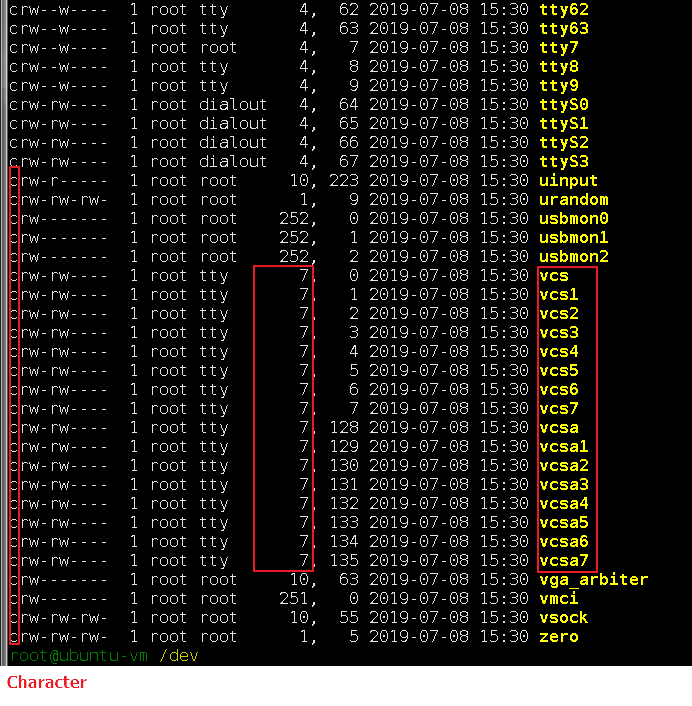  
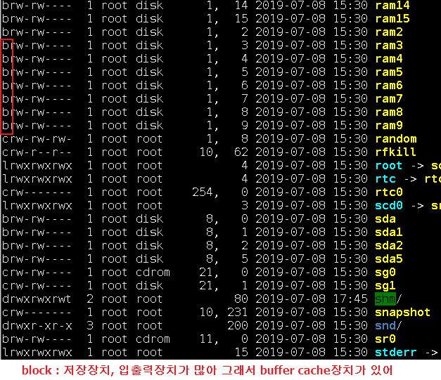  
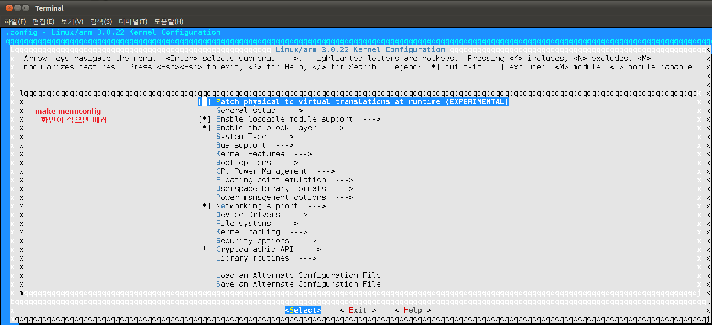  
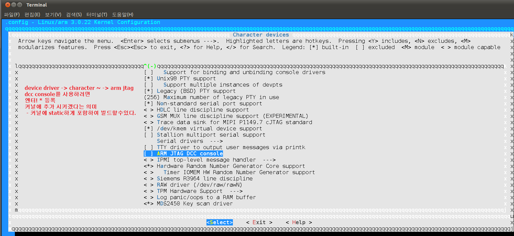  
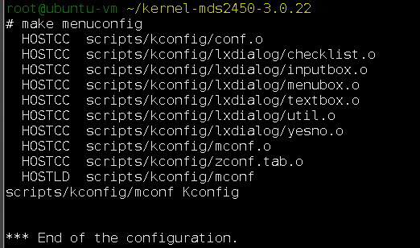  
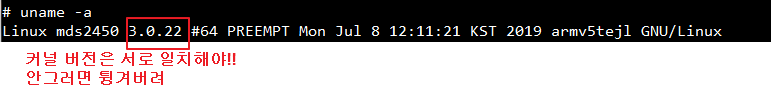  
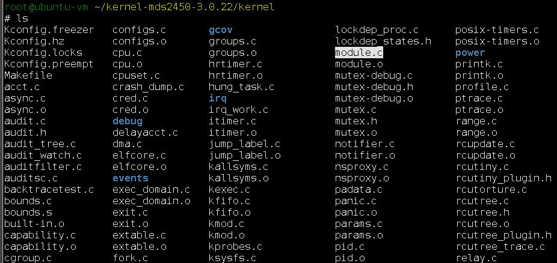  
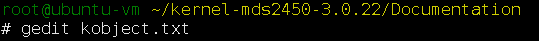  
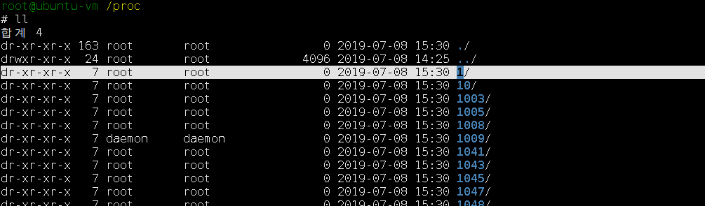  
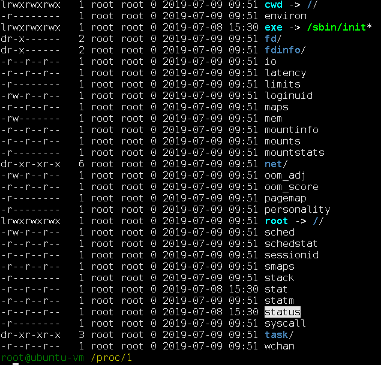  
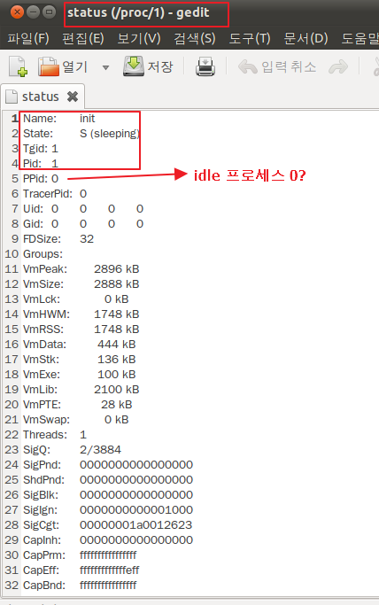  
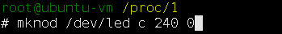  
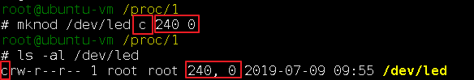  
  
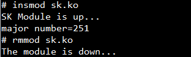  
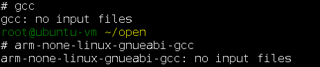  
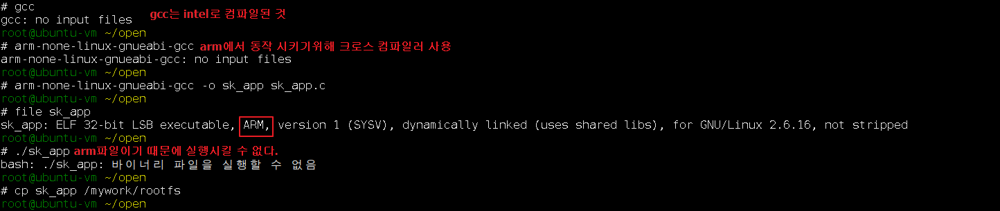  
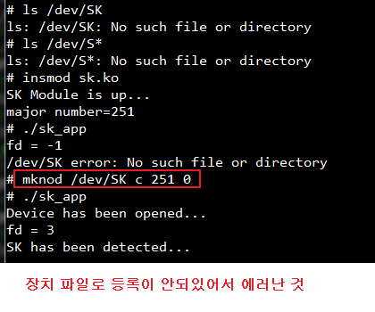  
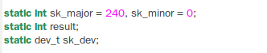  
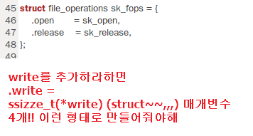  
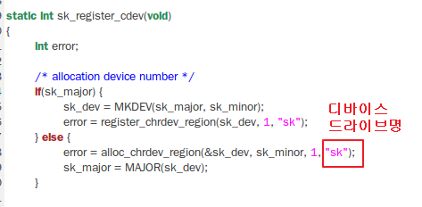  

## led 과제
```c
#define rGPLCON1 *(volatile unsigned long *)(kva + 4)
#define rGPLDAT *(volatile unsigned long *)(kva + 8)
#define rGPMCON *(volatile unsigned long *)(kva + 0x10)
#define rGPMDAT *(volatile unsigned long *)(kva + 0x14)

static void *kva;

kva = ioremap(0x7F008810,28) ;
    // ex > ioremap(0x56000060,28) ; 이 주소를 기준으로 28바이트를 사용하겠다.\
    // 주소를 다이렉트로 사용할수없다. 
    // write에 넣으면 깔끔할 듯
	printk("kva = 0x%x\n",(int)kva);

```

### sk_app.c(application, main)
```c
/***************************************

 * Filename: sk_app.c

 * Title: Skeleton Device Application

 * Desc: Implementation of system call

 ***************************************/

#include <stdio.h>

#include <unistd.h>

#include <stdlib.h>

#include <fcntl.h>


int main(void)

{

    int retn;

    int fd;

    /* write에서 사용할 버퍼 */

    char buf[100] = "write...\n";

    

    fd = open("/dev/SK", O_RDWR);

    printf("fd = %d\n", fd);

    

    if (fd<0) {

        perror("/dev/SK error");

        exit(-1);

    }

    else

        printf("SK has been detected...\n");

    

    /* fd가 가르키는 파일에 buf에 있는 10바이트를 쓰라는 의미 */

    retn = write(fd, buf, 8);

    

    printf("\nSize of written data : %d\n", retn);


    close(fd);

    

    return 0;

}
```

### sk.c(kernel, led)
```c
/***************************************

 * Filename: sk.c

 * Title: Skeleton Device

 * Desc: Implementation of system call

 ***************************************/

#include <linux/module.h>

#include <linux/init.h>

#include <linux/major.h>

#include <linux/fs.h>

#include <linux/cdev.h>

#include <asm/uaccess.h>

#include <linux/kernel.h>

#include <asm/io.h>

#define GPGCON *(volatile unsigned long *)(kva + 0)

#define GPGDAT *(volatile unsigned long *)(kva + 4)


MODULE_LICENSE("GPL");


static int sk_major = 0, sk_minor = 0;

static int result;

static dev_t sk_dev;


static struct cdev sk_cdev;


static int sk_register_cdev(void);


/* TODO: Define Prototype of functions */

static int sk_open(struct inode *inode, struct file *filp);

static int sk_release(struct inode *inode, struct file *filp);

static int sk_write(struct file *filp, const char *buf, size_t count, loff_t *f_pos);


/* TODO: Implementation of functions */

static int sk_open(struct inode *inode, struct file *filp)

{

    printk("Device has been opened...\n");

    

    /* H/W Initalization */

    

    return 0;

}


static int sk_release(struct inode *inode, struct file *filp)

{

    printk("Device has been closed...\n");

    

    return 0;

}


static int sk_write(struct file *filp, const char *buf, size_t count, loff_t *f_pos)

{

	static void *kva;


	kva = ioremap(0x56000060,8) ;	


	GPGDAT |= 0xf << 4;

	

	GPGCON &= ~(0xff << 8);

	GPGCON |= 0x55 << 8;


	 GPGDAT &= ~(0xf  <<  4);


	

	return count;

}


struct file_operations sk_fops = { 

    .open       = sk_open,

    .release    = sk_release,

	.write		= sk_write,

};


static int __init sk_init(void)

{

    printk("SK Module is up... \n");


	if((result = sk_register_cdev()) < 0)

	{

		return result;

	}


    return 0;

}


static void __exit sk_exit(void)

{

    printk("The module is down...\n");

	cdev_del(&sk_cdev);

	unregister_chrdev_region(sk_dev, 1);

}


static int sk_register_cdev(void)

{

	int error;


	/* allocation device number */

	if(sk_major) {

		sk_dev = MKDEV(sk_major, sk_minor);

		error = register_chrdev_region(sk_dev, 1, "sk");

	} else {

		error = alloc_chrdev_region(&sk_dev, sk_minor, 1, "sk");

		sk_major = MAJOR(sk_dev);

	}


	if(error < 0) {

		printk(KERN_WARNING "sk: can't get major %d\n", sk_major);

		return result;

	}

	printk("major number=%d\n", sk_major);


	/* register chrdev */

	cdev_init(&sk_cdev, &sk_fops);

	sk_cdev.owner = THIS_MODULE;

	sk_cdev.ops = &sk_fops;

	error = cdev_add(&sk_cdev, sk_dev, 1);


	if(error)

		printk(KERN_NOTICE "sk Register Error %d\n", error);


	return 0;

}


module_init(sk_init); 

module_exit(sk_exit); 
```

## 구조체 단위 read, write 문제
```c
: copy_to_user()/copy_from_user() 사용
 응용프로그램이 보내준
아래 구조체 형식의 데이터를 드라이버가 받아서 출력시키고 
드라이버는 같은 구조체 형식으로 또 다른 데이터를 응용프로그램에게
보내주고 응용프로그램이 출력시키는 코드를 구현하세요

/*  구조체 포맷  */
typedef struct
{
   int age;  //나이 :35
   char name[30];// 이름 : HONG KILDONG
   char address[20]; // 주소 : SUWON CITY
   int  phone_number; // 전화번호 : 1234
   char depart[20]; // 부서 : mds
} __attribute__ ((packed)) mydrv_data;
//  linux version : __attribute__ ((packed)) mydrv_data;
//   sprintf(k_buf->name,"HONG KILDONG");

```

### mydrv.c(구조체 - read, write)
```c
/*

  mydrv.c - kernel 2.6 skeleton device driver

               copy_to_user()

 */


#include <linux/module.h>

#include <linux/moduleparam.h>

#include <linux/init.h>


#include <linux/kernel.h>   /* printk() */

#include <linux/slab.h>   /* kmalloc() */

#include <linux/fs.h>       /* everything... */

#include <linux/errno.h>    /* error codes */

#include <linux/types.h>    /* size_t */

#include <asm/uaccess.h>

#include <linux/kdev_t.h>

#include <linux/cdev.h>

#include <linux/device.h>


#define DEVICE_NAME "mydrv"

static int mydrv_major = 240;

module_param(mydrv_major, int, 0);


typedef struct
{
   int age;  //나이 :35
   char name[30];// 이름 : HONG KILDONG
   char address[20]; // 주소 : SUWON CITY
   int  phone_number; // 전화번호 : 1234
   char depart[20]; // 부서 : ELAYER
} __attribute__ ((packed)) mydrv_data;
//   sprintf(k_buf->name,"HONG KILDONG");

static int mydrv_open(struct inode *inode, struct file *file)

{

  printk("mydrv opened !!\n");

  return 0;

}


static int mydrv_release(struct inode *inode, struct file *file)

{

  printk("mydrv released !!\n");

  return 0;

}


static ssize_t mydrv_read(struct file *filp, char __user *buf, size_t count,

                loff_t *f_pos)

{

  mydrv_data *k_buf;

  

  k_buf = kmalloc(count,GFP_KERNEL);

  k_buf->age = 35;
  sprintf(k_buf->name,"HONG KILDONG");
  sprintf(k_buf->address,"SUWON CITY");
  k_buf->phone_number = 1234;
  sprintf(k_buf->depart,"ELAYER");
  

  if(copy_to_user(buf,k_buf,count))

  	return -EFAULT;

  printk("mydrv_read is invoked\n");

  kfree(k_buf);

  return 0;


}


static ssize_t mydrv_write(struct file *filp,const char __user *buf, size_t count,

                            loff_t *f_pos)

{

  mydrv_data *k_buf;

    

  k_buf = kmalloc(count,GFP_KERNEL);

  if(copy_from_user(k_buf,buf,count))

  	return -EFAULT;

  printk("age = %d\n",k_buf->age);
  printk("name = %s\n",k_buf->name);
  printk("address = %s\n",k_buf->address);
  printk("phone_number = %d\n",k_buf->phone_number);
  printk("depart = %s\n",k_buf->depart);


  printk("mydrv_write is invoked\n");

  kfree(k_buf);

  return 0;

}


/* Set up the cdev structure for a device. */

static void mydrv_setup_cdev(struct cdev *dev, int minor,

		struct file_operations *fops)

{

	int err, devno = MKDEV(mydrv_major, minor);

    

	cdev_init(dev, fops);

	dev->owner = THIS_MODULE;

	dev->ops = fops;

	err = cdev_add (dev, devno, 1);

	

	if (err)

		printk (KERN_NOTICE "Error %d adding mydrv%d", err, minor);

}


static struct file_operations mydrv_fops = {

	.owner   = THIS_MODULE,

   	.read	   = mydrv_read,

    	.write   = mydrv_write,

	.open    = mydrv_open,

	.release = mydrv_release,

};


#define MAX_MYDRV_DEV 1


static struct cdev MydrvDevs[MAX_MYDRV_DEV];


static int mydrv_init(void)

{

	int result;

	dev_t dev = MKDEV(mydrv_major, 0);


	/* Figure out our device number. */

	if (mydrv_major)

		result = register_chrdev_region(dev, 1, DEVICE_NAME);

	else {

		result = alloc_chrdev_region(&dev,0, 1, DEVICE_NAME);

		mydrv_major = MAJOR(dev);

	}

	if (result < 0) {

		printk(KERN_WARNING "mydrv: unable to get major %d\n", mydrv_major);

		return result;

	}

	if (mydrv_major == 0)

		mydrv_major = result;


	mydrv_setup_cdev(MydrvDevs,0, &mydrv_fops);

	printk("mydrv_init done\n");	

	return 0;

}


static void mydrv_exit(void)

{

	cdev_del(MydrvDevs);

	unregister_chrdev_region(MKDEV(mydrv_major, 0), 1);

	printk("mydrv_exit done\n");

}


module_init(mydrv_init);

module_exit(mydrv_exit);


MODULE_LICENSE("Dual BSD/GPL");

```

### test_mydrv.c(구조체 - read,write)
```c
/* test_mydrv.c */

#include <stdio.h>
#include <stdlib.h>
#include <sys/types.h>
#include <fcntl.h>

typedef struct
{
   int age;  //나이 :35
   char name[30];// 이름 : HONG KILDONG
   char address[20]; // 주소 : SUWON CITY
   int  phone_number; // 전화번호 : "01012345678"
   char depart[20]; // 부서 : "ELAYER R&D"
} __attribute__ ((packed)) mydrv_data;

#define MAX_BUFFER sizeof(mydrv_data)

// sprintf(name,"HONG KILDONG" );
int main()
{
  int fd,i;
  mydrv_data *buf_in,*buf_out;
  buf_in = (mydrv_data *)malloc(sizeof(mydrv_data));
  buf_out = (mydrv_data *)malloc(sizeof(mydrv_data));

  fd = open("/dev/mydrv",O_RDWR);
  printf("size=%d\n",sizeof(mydrv_data));
  /////////////////////////////////////////////////////////////////////////////////
  read(fd,buf_in,MAX_BUFFER);
printf("read after\n");
  printf("age = %d\n",buf_in->age);
  printf("name = %s\n",buf_in->name);
  printf("address = %s\n",buf_in->address);
  printf("phone_number = %d\n",buf_in->phone_number);
  printf("depart = %s\n",buf_in->depart);
printf("read end\n");
  /////////////////////////////////////////////////////////////////////////////////
printf("write start\n");
  buf_out->age = 45;
  sprintf(buf_out->name,"KIM CHEOLSU");
  sprintf(buf_out->address,"SEOUL CITY");
  buf_out->phone_number = 16080;
  sprintf(buf_out->depart,"elayer");
  write(fd,buf_out,MAX_BUFFER);
printf("write end\n");
  /////////////////////////////////////////////////////////////////////////////////
  free(buf_in);
  free(buf_out);
  close(fd);
  return (0);
}

```