# 디바이스 드라이버 4일차

```c
#include <linux/module.h>
#include <linux/kernel.h>
#include <linux/init.h>
#include <linux/delay.h>

#include <linux/timer.h>

struct timer_list timer; //1, 타이머 선언 


void my_timer(unsigned long data)	// 이런 형태를 지켜야 해
{
	int i;
	for(i=1; i<=data; i++) {
		printk("Kernel Timer Time-Out Function Doing_%d...\n", i);
	}
	// 아래 두줄을 없애면 타이머가 한번호출하고 정지
	timer.expires = jiffies + 2*HZ;	// 2초뒤에 업데이트 해주겠니?
	add_timer(&timer);	//2초뒤에 함수 호출, 계속 돌리려면 감아주는 작업이 필요 

	printk("Kernel Timer Time-Out Function Done!!!\n");
}

int timerTest_init(void)
{
	printk(KERN_INFO "timerTest Module is Loaded!! ....\n");	

	init_timer(&timer); // 꼭 해주기!!
	//timer.expires = get_jiffies_64() + 3*HZ;
	timer.expires = jiffies + 3*HZ; // 변수값이 읽어올 때 시작값, 지피는 계속 증가, 현재시간 + 3*HZ만큼 늘려서 만료, 3분뒤에 쉬는시간 드리겠습니다 같은 개념
	timer.function = my_timer;	// 타이머 핸들러 
	timer.data = 5;
	add_timer(&timer);

	return 0;
}

void timerTest_exit(void)
{
	del_timer(&timer);
	printk("timerTest Module is Unloaded ....\n");
}

module_init(timerTest_init);//2. module은 밑에서 분석 시
module_exit(timerTest_exit);

MODULE_LICENSE("Dual BSD/GPL");


/*
 #tail -f /var/log/messages
*/
```

## Kconfig
make menuconfig를 수정해주는 것 

## 앱단에서 사용
system("insmod timetTest.ko");
system("mknod /dev/timerTest c 240 0");


## 디바이스 드라이버 커널에 등록 실습 
- cat /proc/drivers
  - 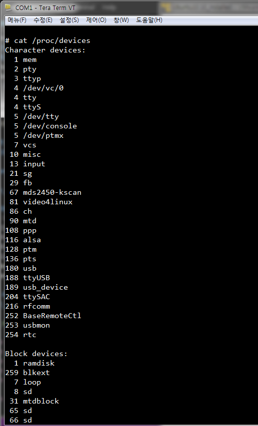
- pc에서 컴파일
  - 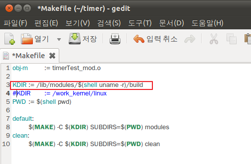
    - KDIR	:= /lib/modules/$(shell uname -r)/build
  - 보드에서 컴파일
    - KDIR :=  /root/kernel-mds2450-3.0.22
  - 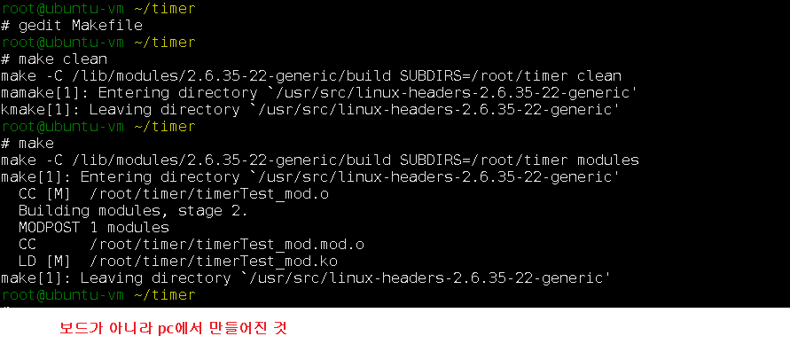
  - 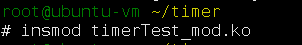
  - 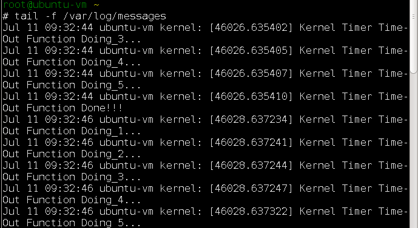
    - ctrl+alt+t : 다른 터미널 open 확인 
- /root/kernel-mds2450-3.0.22/drivers/char
  - 1. Kconfig 수정
    - make menuconfig에 보이게 하도록한다. 
    - 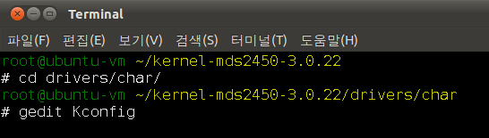
    - 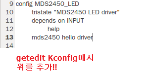
  - 2. Makefile 수정
    - 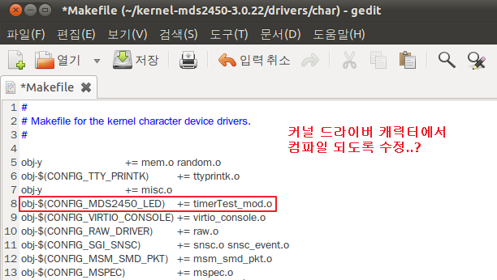
      - 디바이스 드라이버 추가
  - 3. 여기로 디바이스 드라이버 파일 추가 
    - 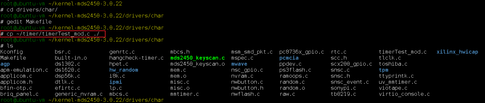
- /root/kernel-mds2450-3.0.22/
  - 커널 최상위 경로
  - make menuconfig 설정
    - 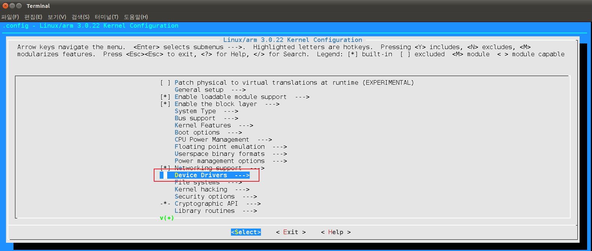  
    - 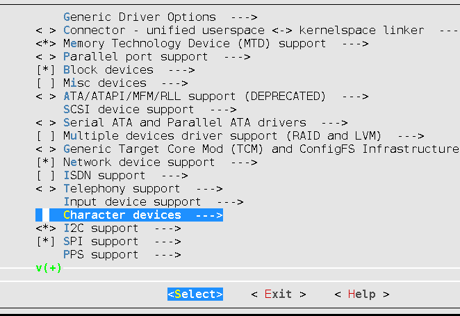  
    - 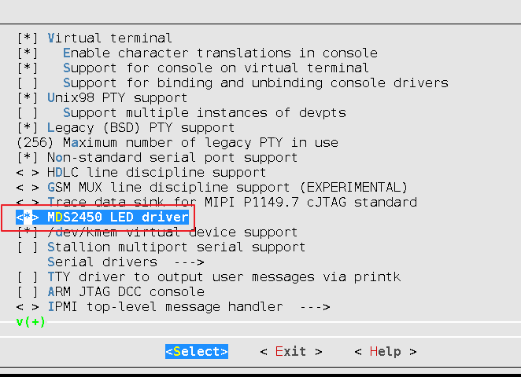  
    - 가장 중요!! save에 yes!!!
  - make clean, make zImage
    -   
- /root/kernel-mds2450-3.0.22/arch/arm/boot
  - cp zImage /tftpboot/
    - 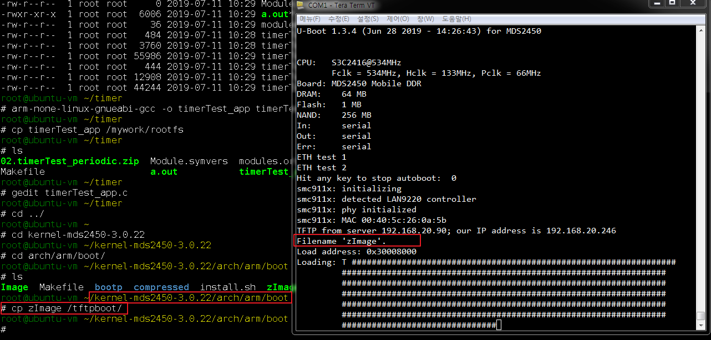  
  - 재부팅 
    - 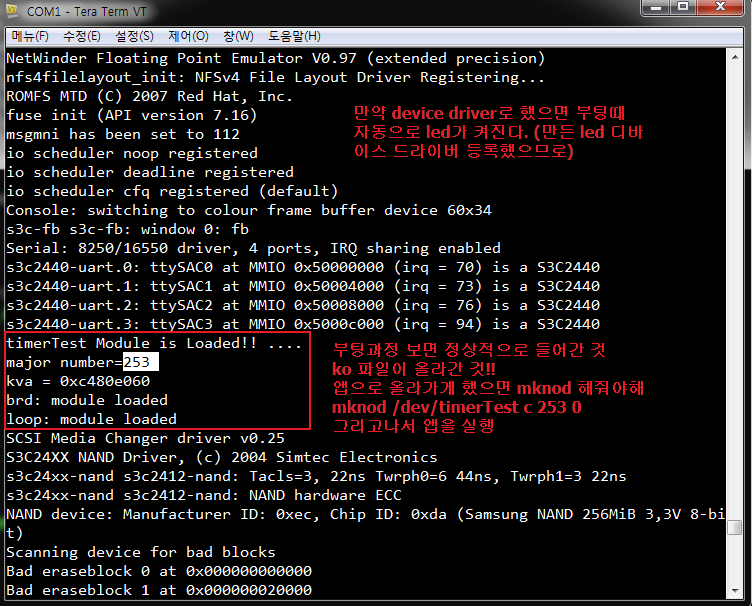  

## 워크 큐
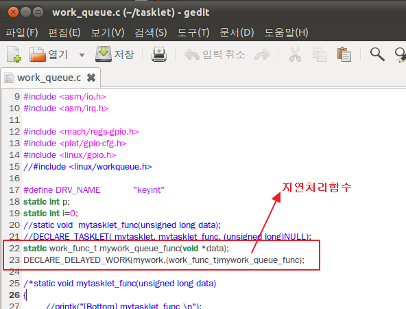  
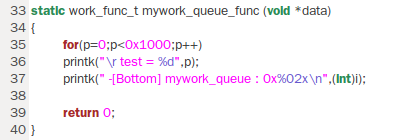  
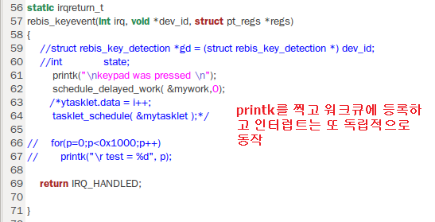  

> 모듈을 디바이스로 만들어라
>   file operations을 만들어야 

## 오늘의 과제

과제: LED 디바이스 드라이버에서 User 시그널을 발생시켜 이 시그널을 
      LED와 연동되고 있는 응용계층의 프로세스의 ID를 파악한 후, 
      시그널을 전달하면 미리 등록되어 있던 
      시그널 핸들러를 응용계층에서
      호출하는 프로그램을 작성하시오.

*** 기능정리 *** 
*응용영역

1) 프로세스 ID를 확인하기 위한 변수선언 ?? 
2) 프로세스 ID 확인 (무슨 함수???)
3) 응용영역에서 프로세스 ID를 디바이스 드라이버로 전달하는 기능
   write(파일디스크립터, &id, 4) 함수 사용
4) usersignal 등록 및 핸들러 등록
5) 무한루프 or 쓰레드....

*드라이버영역
1) 커널타이머 핸들러에서 주기적으로 시그널 발생 
    (커널 영역에서 --> 응용계층으로)
2) 시그널발생시 프로세스 ID를 응용영역에서 전달받아 해당 프로세스에
   User 시그널 발생  
   (ex my_kill_proc)
   my_kill_proc --> 이 함수를 쓰세요..!!!

## pause();
신호가 들어올때까지 멈춰있는 것 

## 타이머
* [타이머 관련 참조](http://jake.dothome.co.kr/lowrestimer/) 
* Lowres(Low Resolution) Timer
  * 커널에서 사용하는 jifffies 기반의 타이머 tick을 소프트웨어 기법으로 구현한 타이머이다. 
  * 커널이 타이머를 요청할 때 만료 시간을 기재하는데 lowres 타이머는 정확하게 그 만료시점에 깨어나는 것을 보장하지 못한다. 
  * 대략 수 백 밀리 초 이내에 실행하는 것만을 보장한다. 
  * 그 외 특징으로 lowres 타이머는 특정 아키텍처와 무관한 구조이다.
* 컴파일 타임에 정적으로 생성
  * DEFINE_TIMER()
* 동적 생성, 변경 및 해제
  * add_timer()
  * mod_timer()
  * del_timer()
* Lowres 타이머는 생성되고 삭제될 수 있으며 아래 timer_list 구조체에 저장된다.
* timer_list 구조체
  * include/linux/timer.h
  * entry
    * 동적 타이머들을 타이머 벡터 리스트로 연결 시 사용한다.
  * expires
    * 타이머가 만료될 미래의 jiffies 시점을 지정한다.
  * function
    * 타이머 만료 시 실행할 함수의 주소를 저장한다.
  * data
    * 타이머 함수에 전달할 인수를 지정한다.
  * base
    * tvec_base 포인터 주소가 담기며 하위 2bit는 다음의 플래그를 담을 수 있다.
    * TIMER_DEFERRABLE (0x1LU)
    * TIMER_IRQSAFE (0x2LU)
  * slack
    * expires에 slack tick 만큼을 추가한 후 변경된 상위 비트 이하로 절삭한다.
    * 예) usb-hcd 드라이버에서 slack=2(100hz, 20msec)를 사용한다.
    * slack을 주어 타이머를 정렬하면 인터럽트 횟수를 줄여 절전 및 처리 성능을 높인다.
* 사용한 timer 변수
  * ```c
        struct timer_list timer;

        init_timer(&timer);
        //timer.expires = get_jiffies_64() + 3*HZ;
        timer.expires = jiffies + 3*HZ;
        timer.function = my_timer;
        timer.data = 5;
        add_timer(&timer);

        void my_timer(unsigned long data)
        {
            int i;
            my_kill_proc(apid, 10);
            timer.expires = jiffies + 2*HZ; // 일정시간 지나면 timer함수 호출?,태엽시계 같은 역할
            add_timer(&timer);
        }
    ```
## [리눅스 디바이스 드라이버 참고](https://dev-ahn.tistory.com/100)


